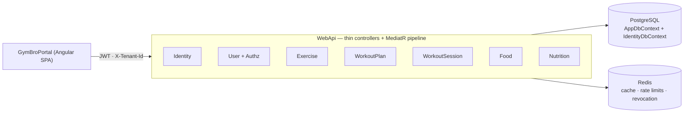

# GymBro API

> Multi-tenant fitness-coaching platform — coaches build versioned workout plans, trainees log sessions, and
> progress is computed from the logs.


GymBro lets a personal trainer run their whole roster from one workspace: invite clients, author workout programs,
assign them with fine-grained visibility, and follow each trainee's logged sessions and personal records. It
solves the everyday coaching problem of **keeping a prescribed plan and a trainee's actual performance in sync** —
plans are immutably versioned, assignments pin a version, and every session is snapshotted so history never
rewrites itself.

This repository is the **REST API**. The Angular web client lives in a separate repository, **GymBroPortal**.

**Status:** MVP. The core *register → invite → assign → log → progress* loop is feature-complete, containerized,
and deployed to a single cloud VM. Unit and integration tests run in CI.

## Key features

- **Workspaces & roles** — every account owns a workspace; a user can be an Owner (coach) in one and a Client (trainee) in another.
- **Client onboarding** — Owners invite Clients with single-use, expiring codes.
- **Versioned plans** — every plan edit creates a new immutable version; older versions stay frozen as history.
- **Smart assignments** — plans are assigned with per-trainee visibility controls (full / guided / blind) and pinned to a version until the coach applies the latest.
- **Session logging** — trainees run one workout at a time, logging sets (weight/reps, time, distance); the API computes training volume, estimated 1RM, and personal records.
- **Global exercise catalog** — a platform-admin-curated library shared across all tenants, served from a Redis-backed cache.
- **Nutrition tracking** — a global food/supplement catalog plus versioned nutrition plans, plan→trainee assignments, and completion-first daily logging with adherence.

## Tech stack

| Area | Choice |
|---|---|
| Runtime | .NET 10 · ASP.NET Core |
| Patterns | Modular monolith · CQRS (MediatR) · `Result<T>` · FluentValidation |
| Data | PostgreSQL · EF Core (two DbContexts) · transactional outbox |
| Cache / limits | Redis (`IDistributedCache` + distributed rate limiting) |
| Auth | JWT access tokens + rotating refresh cookies + SecurityStamp revocation |
| Testing | xUnit · NSubstitute · Testcontainers |

## Architecture

A **modular monolith**: one ASP.NET Core process, seven feature modules over a shared kernel, one PostgreSQL
database. Requests flow through thin controllers → a MediatR pipeline (validation → authorization) → one handler
per use case (returns `Result<T>`, never throws for business rules) → domain aggregates → `AppDbContext`.



| Module | Owns |
|---|---|
| **Identity** | credentials, login, JWT issuance + revocation (`IdentityDbContext`) |
| **User** | `User`, `Tenant`, membership, invites, + the authorization services |
| **Exercise** | the global exercise catalog (cached) |
| **WorkoutPlan** | versioned plan templates + plan→trainee assignments |
| **WorkoutSession** | session logging, performed exercises/sets, derived metrics |
| **Food** | the global food/supplement catalog (+ tenant-custom foods) |
| **Nutrition** | versioned nutrition plans, assignments, daily logging + adherence |

**Cross-cutting highlights** (each links to its owning doc):

- **Tenancy** — application-level multi-tenancy; EF global query filters scope every read by a membership-validated `X-Tenant-Id` (never trusted raw); platform admin bypasses. → [DATABASE](docs/DATABASE.md), [PERMISSIONS](docs/PERMISSIONS.md)
- **Authentication** — short-lived access JWT + rotating httpOnly refresh cookie + per-request SecurityStamp revocation. → [AUTHENTICATION](docs/AUTHENTICATION.md)
- **Authorization** — three roles; tenant role resolved per request from the DB; static permissions in a MediatR behavior, row-level checks in handlers. → [PERMISSIONS](docs/PERMISSIONS.md)
- **Persistence** — PostgreSQL, two EF migration chains; immutable plan versioning; domain events via a transactional outbox. → [DATABASE](docs/DATABASE.md)
- **Caching & background jobs** — Redis-backed cache, rate limiting, and revocation; hosted services for outbox dispatch, token cleanup, and cross-store reconciliation. → [DEPLOYMENT](docs/DEPLOYMENT.md)

```
gymbro/
├── Presentations/WebApi/   # thin controllers, Program.cs (composition root), middleware, health
├── Modules/Modules.*/      # Identity, User, Exercise, WorkoutPlan, WorkoutSession, Food, Nutrition
├── BuildingBlocks/         # Shared kernel · Application (pipeline) · Infrastructure (AppDbContext, JWT, Outbox)
└── Tests/                  # xUnit + NSubstitute + Testcontainers
```

## Quick start

**Prerequisites:** .NET 10 SDK and Docker.

```bash
docker compose up --build          # Postgres + Redis + API; self-migrates and seeds the admin
```

The API comes up on **http://localhost:8080**.

> **Demo credentials** — seeded platform admin: **`admin@gymbro.local`** / **`Admin@123456`**.

<details>
<summary>Run the API natively instead (no Docker for the app)</summary>

```bash
# 1. Provide secrets (never commit these)
cd Presentations/WebApi
dotnet user-secrets set "ConnectionStrings:Database" "Host=127.0.0.1;Port=5432;Database=gymbro;Username=gymbro;Password=gymbro"
dotnet user-secrets set "Jwt:Secret" "$(openssl rand -base64 48)"
dotnet user-secrets set "Jwt:Issuer" "gymbro"
dotnet user-secrets set "Jwt:Audience" "gymbro"
cd ../..

# 2. Apply BOTH migration chains
dotnet ef database update --project BuildingBlocks/Infrastructure/BuildingBlocks.Infrastructure.Persistence --startup-project Presentations/WebApi
dotnet ef database update --project Modules/Modules.Identity --startup-project Presentations/WebApi

# 3. Run (interactive API docs at the root: OpenAPI + Scalar, Development only)
dotnet run --project Presentations/WebApi
```

In Development the `DbSeeder` creates the admin and seeds the exercise catalog automatically.
</details>

## Demo the MVP

With the API running and the **GymBroPortal** SPA pointed at it:

1. **Register** a new account → you land in your own workspace as Owner.
2. As Owner, **create a workout plan** and **generate an invite code**.
3. In a second account, **join** with the code (you become a Client); the Owner then **assigns** the plan to you.
4. As the Client, **start the assigned workout**, log a few sets, and **complete** it.
5. Open the **logs/progress** view — volume, PRs, and weekly totals are computed from your sessions.

The exercise catalog is managed by the seeded platform admin.

## Testing

```bash
dotnet test Solution.sln
```

Integration tests need Docker (Testcontainers) or a `GYMBRO_TEST_DB` connection string — they self-skip locally
without one but **fail** in CI. Strategy and inventory: **[docs/TESTING.md](docs/TESTING.md)**.

## Build & deploy

```bash
docker build -t gymbro-api .       # production image (Kestrel on :8080, TLS terminates upstream)
```

CI builds + tests on every push/PR; CD builds the image, pushes it to GHCR, and deploys on merge to `main`.
Configuration, health probes, migrations, and the reference environment: **[docs/DEPLOYMENT.md](docs/DEPLOYMENT.md)**.

## Documentation

| Topic | Document |
|---|---|
| Architecture, modules, conventions | [docs/ARCHITECTURE.md](docs/ARCHITECTURE.md) |
| Data model, tenancy, migrations | [docs/DATABASE.md](docs/DATABASE.md) |
| Roles, permissions, isolation | [docs/PERMISSIONS.md](docs/PERMISSIONS.md) |
| Authentication & tokens | [docs/AUTHENTICATION.md](docs/AUTHENTICATION.md) |
| Business / lifecycle rules | [docs/BUSINESS_RULES.md](docs/BUSINESS_RULES.md) |
| End-to-end user flows | [docs/USER_FLOWS.md](docs/USER_FLOWS.md) |
| Catalog seeding (exercises & foods) | [docs/SEEDING.md](docs/SEEDING.md) |
| Testing | [docs/TESTING.md](docs/TESTING.md) |
| Deployment & operations | [docs/DEPLOYMENT.md](docs/DEPLOYMENT.md) |
| Not-yet-built design (nutrition & exercise master-data) | [docs/ROADMAP.md](docs/ROADMAP.md) |

Contributor and AI-agent conventions live in [CLAUDE.md](CLAUDE.md).
