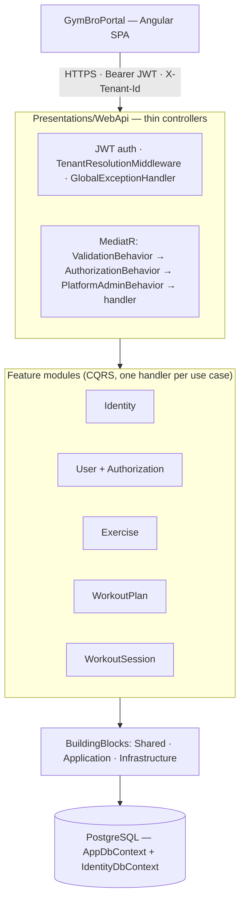
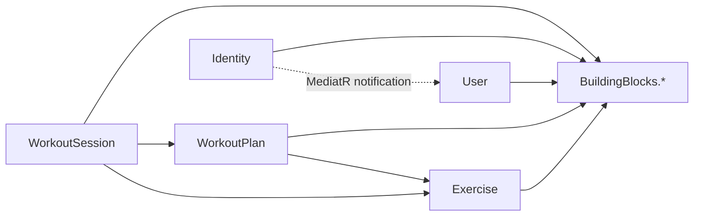

# Architecture & Modules

How the API is structured: the modular-monolith layout, the seven feature modules, their boundaries and
dependencies, and the request pipeline.

**Related:** [DATABASE.md](DATABASE.md) · [PERMISSIONS.md](PERMISSIONS.md) · [USER_FLOWS.md](USER_FLOWS.md) ·
not-yet-built design: [ROADMAP.md](ROADMAP.md)

## The shape: a modular monolith

GymBro is a single ASP.NET Core process composed of feature **modules** plus a shared **BuildingBlocks** kernel.
It is deliberately a monolith, not microservices: one deployable, one physical database. Module boundaries are
real at the application layer — modules talk to each other only through MediatR contracts, never by referencing
each other's entities or persistence.



### Layers (per request)

Thin controller → MediatR command/query (one handler each, returns `Result<T>`, never throws for business
rules) → domain aggregate (private setters, factory invariants) → `AppDbContext` (global filters, soft-delete,
audit, transactional outbox).

### Solution layout

```
gymbro/
├── Presentations/WebApi/        # thin controllers, Program.cs (composition root), middleware, health checks, DbSeeder
├── Modules/Modules.{Identity,User,Exercise,WorkoutPlan,WorkoutSession}/
│       Application/ (Commands, Queries, Handlers, Validators, DTOs, Mapping)  ·  Entities/  ·  Infrastructure/Persistence/ (each module's EF configs + repositories + IModelConfiguration; Identity also owns its own DbContext)
└── BuildingBlocks/
        BuildingBlocks.Shared/         # Result/Error, domain primitives, marker interfaces, ICurrentUser/ITenantContext, Permission/TenantRole
        BuildingBlocks.Application/    # MediatR pipeline behaviors + markers, authorization services, IUnitOfWork/IRepository
        Infrastructure/                # persistence kernel: AppDbContext (model-free), Repository<T>/IModelConfiguration (…Persistence.Abstractions), IdentityDbContext, CurrentUser, TokenService, Outbox
```

## Module boundary rules (the contract)

1. Modules depend **only** on `BuildingBlocks.*` and communicate across boundaries via **MediatR**
   (commands / queries / notifications). No module references another module's **domain entities** or
   **persistence project**.
2. Cross-module **reads** use a MediatR query owned by the source module (e.g. `ResolveExerciseNamesQuery`,
   `GetWorkoutForSnapshotQuery`). The DTOs and shared enums those queries expose (e.g. `PlanVisibilityMode`,
   `PlanSetType`) live in the owning module's `Application` namespace — never in `Entities` — so consumers
   reference the contract, not the entity.
3. Cross-cutting authorization lives in `BuildingBlocks.Application/Authorization`. The User module supplies only
   the membership lookup (`TenantRoleResolver`).
4. All DI wiring happens at the single composition root, `Presentations/WebApi/Program.cs`.
5. The dependency graph is acyclic.

This is **build-enforced**: `Tests/Persistence/ModuleBoundaryConventionTests` scans each module's compiled IL and
fails the build if it reaches into another module's `.Entities` namespace or the Identity module.



## The modules

### Identity (`IdentityDbContext`)
Credentials (ASP.NET Identity), email/password login, password change/reset, admin promotion, and **token
issuance + revocation** (short-lived access JWT, rotating opaque refresh tokens, SecurityStamp revocation —
see [AUTHENTICATION.md](AUTHENTICATION.md)).
- **Public API:** `AuthController` `/api/auth/*` (register, login, refresh, logout, logout-all, forgot/reset/change-password, `GET /me`); `PromoteUserToAdminCommand` via `AdminController`.
- Publishes `UserRegisteredNotification` → User module. May not reference `AppDbContext` or feature modules.

### User (`AppDbContext`)
Domain `User`, `Tenant`, the RBAC join `UserTenantRole`, and `Invite`; tenant create/join/leave, member
directory, invites. **Also hosts the platform-wide authorization services.**
- **Public API:** `UserController` `/api/tenants/*`; `InviteController` `/api/invites/*`; admin operations via `AdminController` `/api/admin/{tenants,users}`.
- Handles `UserRegisteredNotification` (bootstraps a `User` + personal `Tenant` + Owner role). Supplies `TenantRoleResolver` for role lookups.

### Exercise (`AppDbContext`)
The global, platform-shared exercise catalog. Reads are distributed-cached; writes are platform-admin-only.
- **Public API:** `ExerciseController` `/api/exercises/*` (read: any member with `PlanView`; write: platform admin).
- **Cross-module queries:** `ResolveExerciseNamesQuery`, `ValidateExerciseIdsQuery`. Depends on BuildingBlocks only.

### WorkoutPlan (`AppDbContext`)
Versioned plan templates (`TemplateId` + `Version`, immutable versioning) and plan→trainee **assignments**
(visibility flags, snapshots, apply-latest). See lifecycle in [BUSINESS_RULES.md](BUSINESS_RULES.md).
- **Public API:** `WorkoutPlanController` `/api/workout-plans/*` — plans and assignments.
- **Cross-module queries:** `GetPlanAssignmentByIdQuery`, `GetWorkoutForSnapshotQuery`, `ResolvePlanContextQuery`. Depends on Exercise (contracts only).

### WorkoutSession (`AppDbContext`)
Session lifecycle (start / log / edit / complete / abandon), performed exercises and sets, substitution. Raises
`SessionCompletedEvent` through the outbox. Computes read-side metrics (volume, PR count, estimated 1RM).
- **Public API:** `SessionController` `/api/sessions/*`.
- Depends on Exercise and WorkoutPlan (contracts only). May not reference `IdentityDbContext`.

### Food (`AppDbContext`)
The global, platform-shared **food/supplement catalog** (sibling of Exercise). Global reads for any member;
global writes are platform-admin-only; an Owner may add tenant-custom foods (`ISharedEntity`).
- **Public API:** `FoodController` `/api/foods/*`.
- **Cross-module queries:** `ResolveFoodSummariesQuery`, `ValidateFoodIdsQuery`. Depends on BuildingBlocks only.

### Nutrition (`AppDbContext`)
Nutrition **plan → assignment → daily log** — the dietary mirror of WorkoutPlan + WorkoutSession. Versioned
`NutritionPlan` templates, `NutritionPlanAssignment` (pins a version + jsonb snapshot), and a per-date
`DailyNutritionLog` created by snapshot-on-touch with completion-first `LoggedItem`s
(Planned/Completed/Skipped/Substituted/Missed); raises `DailyLogClosedEvent` through the outbox and computes
adherence. Trainee logging is self-scoped on `MeController` `/api/me/nutrition/*`.
- **Public API:** `NutritionController` `/api/nutrition/*` (coach) + `MeController` additions (trainee).
- Depends on Food (contracts only). Not-yet-built nutrition design (offline, reminders, push, analytics): [ROADMAP.md](ROADMAP.md).

### BuildingBlocks (shared kernel)
- **Shared:** `Result`/`Error`, domain primitives (`Entity`/`AggregateRoot`, markers `ITenantEntity`/`ISharedEntity`/`ISoftDelete`), `ICurrentUser`/`ITenantContext`, `Permission`/`TenantRole` enums.
- **Application:** MediatR pipeline behaviors (`ValidationBehavior`, `AuthorizationBehavior`, `PlatformAdminBehavior`) and their markers, authorization services, `IUnitOfWork`/`IRepository`.
- **Infrastructure:** the persistence **kernel** — `AppDbContext` (filters, soft-delete, audit, transactional-outbox write; **model-free**, assembled from injected `IModelConfiguration` contributors), plus the generic `Repository<T>` base and the `IModelConfiguration` seam in `…Persistence.Abstractions` (which the modules reference), `CurrentUser`, JWT `TokenService`, the `Outbox/` types. Each feature module owns its EF configs + repositories (`Modules.X/Infrastructure/Persistence/`) and contributes them via its `IModelConfiguration` (registered by `AddXModulePersistence`); the four cross-module FK configs live at the composition root. The kernel references **no feature module** — enforced by `ModuleBoundaryConventionTests`.

## Cross-module communication

- **Notifications** (MediatR) — `UserRegisteredNotification`, `UserDeletedNotification`. Published inline inside the cross-store transaction.
- **Domain events** (`IDomainEvent`) — written to the transactional **outbox** in the same `SaveChanges` transaction, then dispatched out-of-band by `OutboxProcessor` (at-least-once; handlers must be idempotent). The only domain event today is `SessionCompletedEvent`.
- **Queries** (MediatR) — synchronous cross-module reads through the owning module's contract.

## Forbidden dependencies (quick reference)

| This | must NOT |
|---|---|
| `Identity`, `User` | depend on any feature module (keeps the graph acyclic) |
| Any module | reference `IdentityDbContext`, or another module's entities / persistence project |
| Any business code | read the raw `X-Tenant-Id` header — use `ITenantContext` / `ICurrentUser` |
| Exercise mutations | rely on tenant permissions — use `IPlatformAdminRequest` + `is_admin` |
| Any module | write another module's tables (writes are owned; cross-module is read-only) |

## Conventions

- **`Result<T>` everywhere** — handlers never throw for business rules; controllers map `Error.Code` → HTTP. Unexpected exceptions are caught by `GlobalExceptionHandler` (no stack traces to clients). `DomainException` (invariant violations) → 400.
- **Thin controllers** — bind → dispatch one MediatR command/query → map `Result`. No business logic in controllers.
- **One handler per use case**; **FluentValidation** validators live beside the command. Pipeline order: `ValidationBehavior` → `AuthorizationBehavior` → `PlatformAdminBehavior`.
- **Read handlers may use EF Core directly** — query handlers compose `.Include/.AsNoTracking/.ToListAsync` on `IRepository.Query()`'s `IQueryable`. This is pragmatic CQRS; writes still go through aggregates + `IUnitOfWork`.
- **Explicit DTO mapping** (no AutoMapper) — projections live in `Application/Mapping/<Module>Mapping.cs`, not inline in handlers.
- **Namespaces** `Modules.<Module>Module.<Layer>.<Subfolder>` (folders are `Modules.X`, namespaces `Modules.XModule`).
- **API versioning is header-based** — clean routes (`api/sessions`, not `api/v1/...`); clients negotiate via `X-Api-Version` (omitted ⇒ latest). Mechanism: `ApiVersionMiddleware`.

## Adding a feature (checklist)

1. **Domain** — add/extend the aggregate under `Modules.<Feature>/Entities` (private setters + factory invariants).
2. **Persistence** — add an `IEntityTypeConfiguration` in the module's `Infrastructure/Persistence/Configurations/` (its `IModelConfiguration` picks it up by assembly scan — **no `DbSet`**; access via `Set<T>()` or a repository). A config that references **another** module's entity goes in the composition root's cross-module contributor instead. Pick the marker (`ITenantEntity`/`ISharedEntity`/`ISoftDelete`); register any repository in the module's `AddXModulePersistence`; add a migration on the correct context (see [DATABASE.md](DATABASE.md)).
3. **Application** — add the command/query + handler (returns `Result<T>`) + validator. For a single static tenant permission, implement `ITenantAuthorizedRequest`; otherwise enforce in the handler (see [PERMISSIONS.md](PERMISSIONS.md)).
4. **API** — add the controller action with a clean route; map `Result` → HTTP.
5. **Docs** — update the one doc that owns the changed fact.
