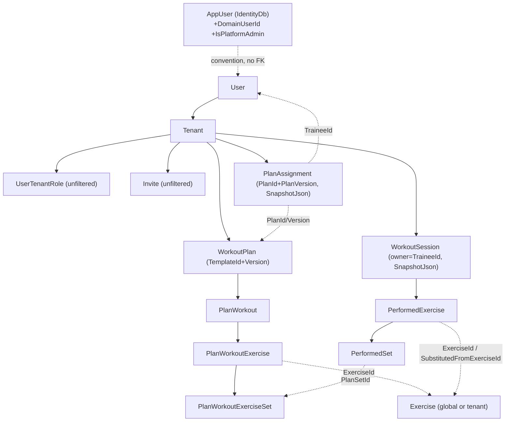

# Database — Data Model, Tenancy & Migrations

Who owns, writes, and reads each entity; how multi-tenancy is enforced at the data layer; the load-bearing
constraints; and how migrations run. (The EF model snapshots are authoritative for exact columns — this doc is
the ownership and rules map, not a column dump.)

**Related:** [ARCHITECTURE.md](ARCHITECTURE.md) · [BUSINESS_RULES.md](BUSINESS_RULES.md) · [PERMISSIONS.md](PERMISSIONS.md)

## Two contexts, two migration chains

| Context | Owns | Note |
|---|---|---|
| **`AppDbContext`** (`BuildingBlocks.Infrastructure.Persistence`) | all domain tables | global query filters + soft-delete + audit + transactional outbox |
| **`IdentityDbContext`** (`Modules.Identity`) | ASP.NET Identity tables + `RefreshTokens` | outside tenant scope; no global filters |

Both run on **one physical PostgreSQL database** but as separate EF migration chains. They are linked **only by
convention** (`AppUser.DomainUserId == User.Id`) — there is no cross-store referential integrity. Write-time
consistency is guaranteed by the cross-store transaction (`ICrossStoreTransaction`); as a durable safety net, the
read-only `CrossStoreReconciliationService` periodically reports drift (an `AppUser` with no live `User`, or vice
versa) via logs + the `GymBro.Reconciliation` metrics — it never mutates.

**Both chains must be migrated** or the DB is half-migrated (startup fails fast when either chain has pending
migrations). Commands and operational detail: [DEPLOYMENT.md](DEPLOYMENT.md).

## Entity ownership & access

Logical ownership is by module (boundaries are enforced by project refs + EF config, not by the DB — all domain
tables share one physical `AppDbContext`). "Write" = the module whose handlers mutate it; cross-module access is
read-only via injected repositories or MediatR queries.

| Entity (table) | Owner | Context | Writes | Tenant filter |
|---|---|---|---|---|
| `AppUser`, Identity tables, `RefreshTokens` | Identity | Identity | Identity handlers | — (no filter) |
| `User` | User | App | User (+ `UserRegisteredNotification`); admin delete | **soft-delete only — visible across tenants** (admin EF bypass; normal paths handler-scoped) |
| `Tenant` | User | App | User; admin delete | **soft-delete only — cross-tenant** |
| `UserTenantRole` | User | App | User (join/leave/remove — **hard delete**) | **no marker — intentional** (tenant switcher reads across tenants); scoped by `UserId`/validated `TenantId` in repo |
| `Invite` | User | App | User (generate/revoke/redeem — **hard delete**) | **no marker — intentional** (redemption must find an invite before membership); scoped in repo |
| `Exercise` (+children) | Exercise | App | Exercise (admin-only) | `ISharedEntity`: `TenantId null` (global) OR == header; + soft-delete |
| `WorkoutPlan`, `PlanWorkout`, `PlanWorkoutExercise`, `PlanWorkoutExerciseSet` | WorkoutPlan | App | WorkoutPlan | `ITenantEntity` == header; + soft-delete |
| `PlanAssignment` | WorkoutPlan | App | WorkoutPlan | `ITenantEntity`; + soft-delete |
| `WorkoutSession`, `PerformedExercise`, `PerformedSet` | WorkoutSession | App | WorkoutSession (owner only) | `ITenantEntity`; sessions soft-delete; **children hard-delete** |
| `Translation` | BuildingBlocks | App | (i18n) | **none — unfiltered** (global i18n by design) |

## Relationships

## Tenant boundaries & global filters

`AppDbContext.ApplyGlobalFilters` builds `finalFilter = IsAdmin OR (tenantFilter [AND !IsDeleted])`:

- **`ITenantEntity`** → `TenantId == X-Tenant-Id` (strict).
- **`ISharedEntity`** → `TenantId == null` (global) OR `== X-Tenant-Id`.
- **`ISoftDelete`** → adds `!IsDeleted`.
- **No markers → no filter** (unfiltered by design: `UserTenantRole`, `Invite`, `Translation`).
- **Platform admin (`IsAdmin`) short-circuits ALL filters** — sees every tenant + soft-deleted rows.

The tenant value is **not** the raw header: `TenantResolutionMiddleware` validates the caller's membership (admins
bypass) and only then sets it; `CurrentUser` reads only that validated value. See
[PERMISSIONS.md](PERMISSIONS.md#tenant-isolation-security-critical--defense-in-depth).

## Load-bearing constraints

- **Plan versioning:** unique index `(TemplateId, Version)` filtered `IsDeleted=false`. `PlanAssignment` pins `PlanId + PlanVersion`. Both snapshot columns (`PlanAssignment.SnapshotJson`, `WorkoutSession.SnapshotJson`) are `jsonb`. `WorkoutPlan.IsArchived` retires a template.
- **One live assignment per (trainee, plan):** unique **partial** index `(TenantId, TraineeId, PlanId)` filtered `IsDeleted=false` (re-assignable after revoke). `PlanAssignment.IsActive` (default `true`) is the pause/resume flag.
- **Durable session history:** `PerformedExercise.ExerciseName` is denormalized (captured at log/substitute time) so renaming/deleting an `Exercise` never rewrites a completed log.
- **Invite:** `Code` fixed 8 chars; unique partial index on `Code` where `IsUsed=false`; unique partial index on `(Email, TenantId)` where `IsUsed=false AND Email IS NOT NULL`.
- **Membership:** unique `(UserId, TenantId)` on `UserTenantRole`.
- **Refresh tokens:** unique index on `TokenHash`; `FamilyId` ties a rotation lineage (see [AUTHENTICATION.md](AUTHENTICATION.md)).
- **Hot-path indexes:** `WorkoutSession (TraineeId, StartedAt)` / `(TraineeId, Status)`; `PlanAssignment (TenantId, TraineeId)` / `(TenantId, PlanId)`; `PerformedSet (PerformedExerciseId, SetNumber)`; `PerformedExercise (SessionId, Order)`.

## Delete & audit semantics

- **Soft-delete** only for `ISoftDelete` aggregate roots (`Exercise`, `User`, `Tenant`, `WorkoutPlan`, `PlanAssignment`, `WorkoutSession`). Children and `UserTenantRole`/`Invite`/`Translation` **hard-delete**.
- Many child relationships are `DeleteBehavior.Cascade`. Because a root's soft-delete is an UPDATE, the DB-level cascade never fires — so delete handlers clear children explicitly (e.g. `ClearPlanStructureAsync` for plans; loading child collections so EF cascade hard-deletes them for exercises). Children stay hard-deleted to keep the unique-index re-insertion guards intact.
- Admin delete of a domain `User` cascades via `UserDeletedNotification`; `AdminDeleteTenant` relies on cascade + soft-delete of roots.
- Audit stamps `*OnUtc` automatically; `CreatedBy`/`ModifiedBy` are auto-populated from `ICurrentUser` on save.
