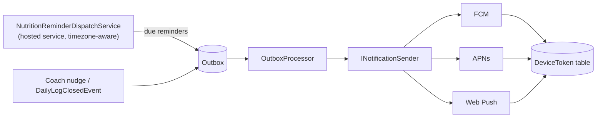

# Roadmap — Not-Yet-Built Design

> **As-built behaviour lives in the core docs** ([ARCHITECTURE](ARCHITECTURE.md), [DATABASE](DATABASE.md),
> [PERMISSIONS](PERMISSIONS.md), [BUSINESS_RULES](BUSINESS_RULES.md), [USER_FLOWS](USER_FLOWS.md),
> [SEEDING](SEEDING.md)). **Everything in this document is not-yet-built design — aspirational by definition.**
> It is the forward plan distilled from the original nutrition and exercise-master-data proposals; the full
> competitive surveys, per-source licensing audits, and sources lists are condensed here and recoverable from
> git history.

This is the **one home for all deferred design** across the two large feature programs:

- **Part A — Nutrition (future).** The nutrition catalog + plan/assignment/daily-log core loop, the
  metrics/check-in slice, the assignment lifecycle (archive/pause-resume/apply-latest), and now the
  **recurrence/day-type engine** (A2) **have shipped** (see the core docs). What remains future: **offline-first
  logging, reminders + server push**, and the deferred parts of the catalog/metric model. (Analytics & coach
  dashboards are a separate later effort — intentionally out of scope here.)
- **Part B — Exercise master-data (future).** The file-based exercise catalog **seed has shipped** (see
  [SEEDING.md](SEEDING.md)). What remains future: the **commercial-grade master-data model** (richer
  classification axes, muscle/role modelling, structured localized instructions, media, search, programming/
  safety reference data) and the **import pipeline** to scale the catalog.

The unifying design principle across both: **closed sets are lookups referenced by ID, open prose/signals are
typed series, identity is stable, additive over destructive, provenance + license travel per row.** New
capability lands as new rows, not new schema.

---

# Part A — Nutrition (future)

The shipped subset is the catalog (`Modules.Food`), the plan→assignment→daily-log spine (`Modules.Nutrition`),
completion-first logging, and the `MetricEntry` check-in slice. The thesis was *reuse the workout
plan→assignment→session spine verbatim*, add **two genuinely new subsystems** — **reminders/notifications** and
**offline-first logging** — and one new catalog. Those two new subsystems, plus the richer reads and deferred
model, are below.

## A1. Offline-first logging (Flutter) — the local mutation queue

Nutrition logging happens in low-signal places (kitchen, commute, gym floor) and a lost "ate it" tap corrupts the
adherence data the feature exists for, so offline tolerance is a **requirement**, not a nicety (unlike workout
logging, which is real-time, coach-monitored, and deliberately online-only). The design is the **smallest correct
primitive**, not a sync framework; the web portal stays online-first.

**Mechanism.** A local **`drift` (SQLite)** store holds (a) a **mirror of recent days** so "Today" and the last N
days render offline, and (b) a **pending-mutation queue** — each row is one `LoggedItem`
create/edit/skip/substitute/metric carrying a **client-generated GUID `clientItemId`** + an **idempotency key** +
a monotonic local seq. Writes are **optimistic**: local state + queue first (instant UI), network later. On
connectivity the queue flushes via the batch endpoint below; the server upserts idempotently by `clientItemId`
(a replay is a no-op success), returns server truth per item, and the client reconciles and clears the queue.

**Conflict policy: last-write-wins per item** — sufficient because nutrition writes are **single-author and
append-mostly** (a user edits *their own* day; a coach never writes a trainee's log), which is why no CRDT/merge
engine is needed.

### The idempotent-write `clientItemId` / `/sync` batch contract *(future-only — exists nowhere as-built)*

Shipped nutrition writes are ordinary (non-idempotent). The offline phase makes the write contract idempotent:

- Trainee log writes accept a **client-generated `clientItemId` (GUID)** + an **idempotency key**. The server
  upserts: a re-sent create with a known `clientItemId` returns the existing item (`200`) instead of creating a
  duplicate. Backed by a unique `(DailyNutritionLogId, ClientItemId)` index + upsert — the *exact* idempotency
  posture the platform already runs (at-least-once outbox; the session start-handler tolerates a duplicate-insert
  race via its unique index). **Validation is unchanged** — FluentValidation still runs; idempotency is about
  *create semantics*, not skipping validation.
- **`POST /api/me/nutrition/sync`** — **batch** apply a queue of offline mutations; the server upserts each by
  `clientItemId` and returns server truth per item for reconciliation. The API stays **stateless and
  "offline-unaware"** — it just accepts client ids and upserts; nothing bypasses tenant validation or scoping
  (queued writes carry the user's auth on flush and hit the self-scoped `/api/me` surface).

**Scope discipline:** MVP-of-the-offline-phase = offline **writes** (never lose a logged meal) + offline **read**
of cached recent days, one-directional flush. Richer two-way reconciliation (e.g. phone + tablet same day) is a
later refinement the `clientItemId` + server-truth-on-ack design already supports without rework. **Dependency
cost:** Flutter adds `drift` (+ `sqlite3_flutter_libs`) and `flutter_local_notifications` — a bounded, deliberate
increase over today's deps, each justified by a brief requirement.

## A2. Recurrence & reminders (client-local-first)

### The recurrence rule *(core SHIPPED — per-meal recurrence + day-type evaluation)*

Workouts have only a `frequencyDaysPerWeek` integer; nutrition genuinely recurs **by time-of-day and day-type**,
so this is the platform's first real recurrence engine. Modelled as **declarative data on the plan, never
generated rows**.

**As-built.** Each `PlanMeal` carries a `ScheduledTime` (local `TimeOnly`) + a `DayApplicability`
(`EveryDay | TrainingDay | RestDay`, in `BuildingBlocks.Shared.Nutrition`). The evaluation rule —
`NutritionScheduleRules.Applies(applicability, isTrainingDay)` — lives once in the shared kernel (C#, the server
source of truth, like `ExerciseTrackingRules`) and drives the daily-log snapshot: when a `DailyNutritionLog`
opens, only the meals applicable to that date's training/rest type are seeded (so a rest day isn't penalised for
skipping training-day meals). **"Is today a training day?"** is a read-only MediatR cross-module query
(`IsTrainingDayQuery`, owned by WorkoutSession — a date is a training day if a workout session falls on it in the
trainee's zone), with a graceful default (rest day) when absent. Both clients already author + display
`ScheduledTime`/`DayApplicability`; they render the server-seeded day, so no client-side evaluation is needed yet.

**Remaining.** An assignment-level `Schedule` (`ScheduleJson` recurrence defaults + per-meal overrides) and an
explicit `DaysOfWeek` bitmask beyond the three day-types; a **client-side mirror** of the rule for previewing a
day + driving local reminders; and a more precise training-day signal once workout plans encode weekday schedules
(today it keys off an actually-logged session, which is the graceful default for proactive morning seeding).

*Why declarative, not RRULE/cron/generated-rows:* declarative recurrence is inspectable, editable, reversible,
and shareable across three runtimes; RRULE has no native training/rest concept; generated rows are rigid and unbounded.

### Reminders = scheduled local OS notifications (MVP of the reminders phase)

Because the day's meal times are **deterministic and known on-device**, the first reminder is a **local
notification** — no server. Flutter adds `flutter_local_notifications`; on app open / plan change / midnight
rollover it computes today's (and tomorrow's) meal times from the shared rule set and (re)registers local
notifications ("Lunch — tap to log"), deep-linking to the focused Today item. Quiet hours + per-meal toggles are
local user prefs; OS permissions respected, degrade gracefully if denied. Local-first wins on
reliability-per-effort (the OS fires it even if the app is closed), works offline, is privacy-preserving (the
schedule never leaves the device), and ships without touching the backend. Web reminders are deferred (the portal
is a coach/review surface; a PWA + service worker + Web Push is the later path, folded into the server-push
phase).

### The `DeviceToken` + `INotificationSender` push design *(future-only — designed, deferred, not in schema)*

Needed for what local notifications **cannot** do: **coach-initiated nudges**, **cross-device** consistency,
**adherence alerts** ("3 meals missed today"), and **web** reminders. Real new infrastructure, fully specified so
MVP choices don't paint us into a corner:



- **`DeviceToken`** table — **no tenant marker** (a device belongs to a *user* across gyms; scoped by `UserId`
  like `UserTenantRole`), registered by the client, revoked on logout-all (reusing the refresh/SecurityStamp
  revocation instincts). Stored hashed/opaque.
- **`INotificationSender`** abstraction with FCM / APNs / Web-Push adapters — credentials via the existing
  config/secret mechanism (`Notification:*`); **absent ⇒ no-op** (mirrors how SMTP degrades to a logger when
  unconfigured).
- **`NutritionReminderDispatchService`** — a hosted `BackgroundService` alongside `OutboxProcessor`/cleanup. It
  wakes periodically, finds users whose **local** time has reached a scheduled reminder (timezone is the hard
  part — store the trainee's tz on the assignment/day and the device, compute "due" in their local time), and
  **writes the reminder to the outbox** rather than sending inline — so delivery inherits the outbox's
  at-least-once, multi-instance-safe (`FOR UPDATE SKIP LOCKED`) guarantees. Adherence/coach alerts ride the
  already-raised `DailyLogClosedEvent` → an outbox handler composes the push.

Deferred because it is the single largest new subsystem (device tokens, three transports, tz-aware scheduling,
quiet-hours, dedupe-with-local-notifications) and local notifications cover the daily-reminder 80%.

### Timezone & day-boundary correctness

The highest-attention correctness area, deliberately isolated to the schedule/day subsystem so it can be tested
exhaustively (pure-function `NutritionScheduleRules` + day-boundary unit tests). `DailyNutritionLog.LocalDate` is
computed from the trainee's tz **at open time** and the tz is **stored on the row** (`ClientTimezone`, like
`WorkoutSession.ClientTimezone`), so travel never retro-relabels past days. Day-close (Planned ⇒ Missed, adherence
finalize) fires at the trainee's **local** midnight, handled **lazily** on first interaction the next local day
(no global midnight job); the optional dispatch service can also close stale days for alerts. (The lazy-close +
`ClientTimezone` capture is **already as-built** for the shipped logging loop; the schedule-driven reminders that
ride on it are the future part.)

## A4. Deferred model & client surfaces

- **Catalog model (deferred to match the *current* `Exercise` catalog, which carries no slug/provenance):** the
  proposal's `slug`, provenance/license columns, and the normalized `FoodNutrient` / `FoodServing` /
  `FoodTranslation` tables — headline macros are denormalized onto the `Food` row for now. The full nutrient model
  is **additive axes** (a closed `Nutrient` lookup + `FoodNutrient(FoodId, NutrientId, AmountPer100g)`, headline
  macros denormalized for the hot path), so adding vitamin D / omega-3 later is a new lookup row, not a migration.
- **`MetricEntry` (full design — the MVP slice is built; the rest deferred):** the built slice is a single numeric
  value + optional unit, free-form `Type` string, **no `TenantId`** (purely personal, self-scoped), append-only
  newest-first. Still deferred: the **`MetricType` lookup** (`ValueKind`: numeric / scale-1-5 / duration / text /
  photo; `AllowMultiplePerDay` flag), **photos** (`PhotoRef` — object storage + signed URLs, stricter than public
  exercise media because these are private body data), **wearable/AI sources** (`Source = wearable|ai` — an
  ingestion adapter is a new writer, not a new model), and per-type uniqueness rules. One typed series absorbs the
  brief's whole open-ended "future expansion" list (body weight/fat/measurements, water, sleep, energy, mood,
  digestion, HRV, …) as data, not schema. A future enhancement makes it the **canonical weight series**,
  cross-referencing `WorkoutSession.BodyweightKg`.
- **Visibility redaction:** **`HideMacroTargets` is now redacted on read** — the trainee's day reads null the
  planned macro *targets* (filter-on-read, trainee-path only; coach reads keep the full prescription), the
  nutrition sibling of workout `HideSetsReps`/`RedactSnapshotTargets`. Still future: the coarser
  `NutritionVisibilityMode` (Guided/Blind) plan-structure hiding and `HideFutureDays`. (`DisableTraineeEditing`
  must never block logging actuals — recording what you ate is always allowed, mirroring the workout rule.)
- **Assignment lifecycle + day-type recurrence are BUILT:** plan archive / pause-resume / apply-latest for
  nutrition assignments, and `DayApplicability` training/rest-day filtering (A2), have shipped.
- **Client surfaces not built:** the Flutter pure-Dart `nutrition_adherence.dart` / `nutrition_schedule.dart`
  helpers, the mobile offline queue, and reminders; on web, the per-meal **schedule editor** beyond time +
  day-type.

## A5. Domain events (the seam for future consumers)

`DailyLogClosedEvent(traineeId, tenantId, date, adherencePct, missedCount)` is **already raised** through the
existing transactional outbox at day-close (today log-only, mirroring `SessionCompletedEvent`). The designed
future consumers — streak recompute, coach digest, AI insight, "you missed X" push — attach to it without new
eventing infrastructure. `NutritionPlanAssignedEvent(assignmentId, traineeId, tenantId, planId, planVersion,
startDate, endDate)` is **now also raised** on assignment (drained to the outbox; no consumer yet) — the seam the
reminders phase (eagerly seed today's log / schedule reminders) attaches to.

## A6. Sourcing-integrity note (carried)

No nutrition-science or licensing claim should ship unverified: calorie/macro reference values, the
Mifflin-St Jeor / Katch-McArdle BMR formulae, the Atwater factors (4/4/9 kcal per g), and the exact licensing
terms of USDA FDC and Open Food Facts must be **confirmed against the authoritative source before
implementation**. The shipped food seed already obeys this (see [SEEDING.md](SEEDING.md)); the deferred model
inherits the same discipline.

---

# Part B — Exercise master-data (future)

The shipped subset is the **file-based seed** of an 86-exercise starter catalog ([SEEDING.md](SEEDING.md)). This
part is the still-pending plan to grow that into a **production-grade exercise library at the quality bar of
Strong / Hevy / Fitbod / ExRx / Technogym**, scaling to **5,000–10,000+ exercises**, multiple languages, AI
coaching, analytics, and enterprise customers. **No code beyond the seed exists.**

> The full 12-platform competitive survey and the per-source licensing audit are condensed below; the detailed
> tables and sources are recoverable from git history.

## B1. The licensing constraint (the gate on everything)

A field model is worthless if the data filling it can't be legally shipped. The headline finding: **the only
sizeable source cleanly usable for a closed commercial product with zero strings is the `yuhonas/free-exercise-db`
*data* (The Unlicense / public domain, 873 exercises)** — but its bundled *images* trace to Everkinetic
**CC-BY-SA 3.0** and must be replaced or independently licensed (data and media are **separate license regimes**).
Everything else is copyleft (wger CC-BY-SA, exercisedb-api AGPL), non-commercial (Compendium of Physical
Activities CC-BY-NC-ND), proprietary (ExRx — never scrape), partnership-gated (Technogym), or provenance-risky
(scraped Kaggle). **Recommended sourcing:** free-exercise-db data + our own/exercisedb.io-licensed images + an
MIT muscle-map SVG (e.g. `body-highlighter`) + **in-house-authored** science values (rep/%1RM/rest, RPE↔RIR, MET
— derive from NSCA/ACSM facts, never copy tables or branded models like NASM OPT). **Never blend CC-BY-SA / NC /
AGPL into the owned master table** — the same quarantine rule the seeders already enforce ([SEEDING.md](SEEDING.md)).

## B2. The target master-data model

Design principles: **orthogonal axes** (not one flat `category`); **closed sets as lookups referenced by ID** with
labels in the app i18n layer; **open prose in a separate translation table**; **immutable language-neutral
identity** (GUID `Id` + stable `Slug`); **provenance + license per row and per media asset**; **`ContentVersion`**
for staleness/import reconciliation; **additive over destructive**.

```
Exercise (invariant master — language-neutral facts only, NO display text)
 ├─ ExerciseTranslation   (name, aliases, structured instructions … per BCP-47 locale)  [LOCALIZED]
 ├─ ExerciseMuscle        (muscle role + contribution weight)                            [join + payload]
 ├─ ExerciseEquipment     (required / optional / alternative)                            [join + payload]
 ├─ ExerciseMedia         (renditions/poster/placeholder/duration + license)             [media regime]
 ├─ ExerciseProgramming   (per-goal rep/%1RM/rest/RPE; MET)                              [reference values]
 ├─ ExerciseRelationship  (variation/progression/regression/alternative/antagonist/…)    [self-graph]
 ├─ ExerciseSafety        (contraindications, spotter, injury risk)                      [safety]
 └─ ExerciseSearchDoc     (materialized tsvector + trigram, per locale)                  [search, derived]

Lookups (closed sets, ID-referenced): Muscle · MuscleGroup · Equipment · EquipmentCategory · MovementPattern ·
  ForceType · Mechanics · PlaneOfMotion · KineticChain · Utility · DifficultyLevel · TrackingType · TrainingGoal
```

All of this lives in `Modules.ExerciseModule`; other modules integrate via shared MediatR contracts + `ExerciseId`
FKs only. The `ExerciseTrackingType` + tracking-metric matrix stays in `BuildingBlocks.Shared.Tracking` as today.

The differentiators worth modelling (the moat — most platforms lack them): **ExRx-grade mechanics / force /
utility + a 5-role muscle model** (PrimeMover / Synergist / Stabilizer / DynamicStabilizer / Antagonist) **with a
0–1 `ContributionWeight`** (powers per-muscle volume, Fitbod-style recovery/fatigue, balance analytics,
injury-aware substitution); **plane of motion** and **movement pattern as first-class axes**; a
**progression/regression graph** (AI substitution); **aliases** (the #1 practical search gap); and per-muscle
contribution weighting for AI/recovery. Muscle granularity goes 6 → ~20 (Hevy bar); equipment 5 → ~17 + category.

**Instructions** become **structured, individually localizable** fields on `ExerciseTranslation` —
`Overview, Setup, Execution[], Breathing, Tempo, Cues[], CommonMistakes[], SafetyNotes, AdvancedNotes` (the NSCA
technique schema, citable for structure; text authored/licensed, never copied) — enabling per-section rendering,
translation, and AI grounding. **Localization** is a normalized `ExerciseTranslation` table keyed on BCP-47 locale
(requested → base → canonical English fallback), with `SourceVersion` vs `ContentVersion` **staleness detection**
(stale ⇒ `Outdated`, never silently published), ICU/CLDR plurals, canonical-unit storage, and RTL-ready logical
layout. (Note: a generic `Translations` table was attempted and removed; the target is exercise-specific and
versioned — don't repeat the generic approach.) **Programming/safety/analytics** add per-goal
rep/%1RM/rest/RPE↔RIR (RPE stays **integer 1–10**, Zourdos-compatible), structured contraindication/spotter
safety, and `MetLight`/`MetVigorous` MET (all calorie figures labelled "estimated"). **Search** moves from
case-sensitive `LIKE`-on-name to PostgreSQL **FTS (`tsvector` GIN) + `pg_trgm` fuzzy + faceted filters** over the
structured enums, per locale, ranked by `PopularityScore` (exact-name > alias > keyword). A dedicated engine
(OpenSearch/Meilisearch/Typesense) is **not** adopted preemptively — Postgres FTS covers 5–10k × few languages.
**Data-quality gates at publish time**: ≥1 PrimeMover with weights ≈1.0, all axes set, ≥1 equipment, a
canonical-locale translation with ≥2 Execution steps, ≥1 clean-licensed media asset, `Source`+`LicenseCode` set,
explicit safety fields on risk-bearing lifts, no duplicate slug/alias, inverse-consistent progression links —
plus a human reviewer (`ReviewedBy`) for safety text (**no auto-publish of AI-drafted safety content**; AI drafts,
a qualified human signs off).

## B3. Media strategy

Governing rules: **never serve media from the app server**, **never ship animated GIFs**, **never scrape
competitor assets**, **store license + attribution on every asset**. Formats: **AVIF → WebP → JPEG** for raster,
**SVG** for line-art; **Lottie** for vector motion and **muted looping MP4 + WebM** (`<video>`) for filmed clips
(a GIF is ~3.7 MB where the MP4 is ~0.5 MB); **HLS** (H.264 baseline + optional HEVC/AV1, 4–6 rendition ladder,
~2 s GOP, poster frame) only for longer coaching/mistakes videos. Renditions: `thumb`/`card`/`detail`/`hero` with
`srcset` widths on web and 1x/2x/3x density buckets on Flutter. **Storage/CDN:** object storage (Cloudflare R2
zero-egress / S3 / B2) behind a CDN, origin locked to CDN-only, **immutable content-hashed URLs**
(`Cache-Control: …, immutable`) with the DB storing only the asset key/hash; **signed URLs only for premium
video** (public exercise images stay unsigned). **Pipeline:** upload original → background worker derives
sizes/formats/posters → derivatives bucket → CDN → DB row (keys + LQIP `BlurHash`/`ThumbHash` + license).
.NET image derivation: **ImageSharp** (mind the Six Labors **Split License** above ~$1M revenue) or **NetVips**
(permissive fallback); **ffmpeg** for video/HLS. The thin `ExerciseMedia { Type:string, Url }` becomes
`{ MediaType, Role, AssetKey, RenditionSet, PlaceholderHash, DurationMs, Poster, LanguageCode?, + license block
(LicenseCode, AttributionText, SourceUrl, Author, RequiresAttribution, ShareAlike) }`.

## B4. Migration plan (current → target)

The current `Exercise` aggregate is clean for *strength/conditioning logging* but thin for *master-data at scale*:
coarse enums (`MuscleGroup` 6, `Equipment` 5, `MovementType` compound/iso only), boolean muscle role with no
contribution weight, flat instruction steps, **no localization** (the generic `Translations` table was created
then removed), `LIKE`-on-name search, a single-URL `ExerciseMedia` with no license, free-text safety, no
programming/MET/relationships, **no provenance/license**. The **denormalized `PerformedExercise.ExerciseName` +
`TrackingType` snapshot is a strength to preserve** — never FK-cascade into logged history.

Principles: **additive first, destructive last** (mirror the `TrackingType` migration); preserve the
denormalization invariant; two migration chains — run both, `dotnet ef` tooling never hand-written; every step
independently shippable + reversible; reintroduce localization **deliberately** (exercise-specific + versioned,
not the generic table that was dropped). Phased, each a `dotnet ef` migration + PR, clients updated only when a
phase exposes new fields:

- **A — Provenance & versioning** (`Slug`, `Source`, `LicenseCode`, `ContentVersion`, `Status`; backfill seeded
  set as `in-house`/`Published`) — low risk, the legal-clean anchor **before** any bulk import.
- **B — Classification axes** (`MovementPattern`, `ForceType`, `PlaneOfMotion`, `KineticChain`, `Utility`,
  `Laterality`, `PrimaryBodyRegion`, nullable; backfill the known lifts).
- **C — Muscle model upgrade** (the big one): `Muscle` lookup (~20) mapped to coarse `MuscleGroup` for backward
  compat; add `Role` + `ContributionWeight` to `ExerciseMuscle`; dual-write `MuscleId`, cut readers over, drop the
  enum column last; preserve ≥1-PrimeMover invariant.
- **D + E — Structured instructions + Localization together** (both live on `ExerciseTranslation`; map flat steps
  → `Execution[]`, backfill `en`, then deprecate `DefaultName`/`DefaultDescription`; staleness gate live).
- **F — Aliases & search** (`ExerciseSearchDoc` tsvector + trigram, GIN-indexed; replace `LIKE`).
- **G — Equipment / media / safety / programming / analytics / relationships** (lookups + joins; expand
  `ExerciseMedia`; `ExerciseSafety`; `ExerciseProgramming` + MET; `ExerciseRelationship` graph; retire
  `MovementType`).
- **H — Bulk import & scale-up** (only now, model + guardrails complete) — the seeded set becomes the
  quality-reference set.

## B5. Import pipeline (ETL)

Runs **only after** the target model + legal-clean guardrails exist (Phase H). Job: normalize raw datasets onto
the target model, **reject anything legally or qualitatively unfit**, deduplicate, attach media, version, and make
every run reversible. Principles: **quarantine by license at the gate** (a precondition, not a review step —
reject `CC-BY-SA-*`/`CC-*-NC-*`/`AGPL` before any work); **idempotent & re-runnable** (slug + fuzzy match,
generalizing the seeder's idempotency-by-name); **staging before production**; **human-in-the-loop for safety
content**; **versioned & reversible by batch**. Stages: `Ingest → License-gate → Normalize/map → Validate →
Dedup/match → Media fetch+derive → Stage → Review → Promote → (Reconcile updates)`, with rollback on any batch.
Validation runs the publish-gate rules as import-time checks and **downgrades** failing rows to `Draft` with a
machine-readable checklist (enrichment queue) rather than killing them; dedup matches by exact slug → normalized
name → **fuzzy (trigram + alias + primary-muscle + equipment)** as a **human-confirmed merge candidate**, enriching
the existing record rather than inserting a duplicate. CC-BY-SA/missing-license images are queued for replacement,
never imported into the core set. It runs as a **separate console/worker tool** (not the request path) reusing the
domain `Exercise.CreateGlobal(...)` factory + FluentValidation, with per-stage observability and **no silent caps**
(it logs what was dropped and why). First production run: ingest free-exercise-db data (873) → normalize →
classification/instruction gaps become the enrichment backlog → dedup against the seeded set (which wins on
quality) → replace flagged images → stage/review/sign-off → promote, then iterate with additional licensed sources
toward 5,000–10,000+.

## B6. Sourcing-integrity note (carried)

No exercise information should be invented: every scientific value, taxonomy, and licensing claim must be
attributed and confirmed against its source before shipping. "Movement pattern" is coaching literature (Dan John /
functional training), **not** an ACSM/NSCA/WHO standard — attribute accordingly; NSCA and ACSM differ on novice
strength %1RM — store both with source labels, never blend; the Compendium MET table is CC-BY-NC-ND (the numbers
are facts, the table is not — author our own reference). The shipped seed already obeys this discipline
([SEEDING.md](SEEDING.md)).


