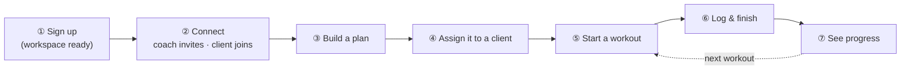
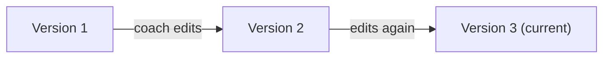
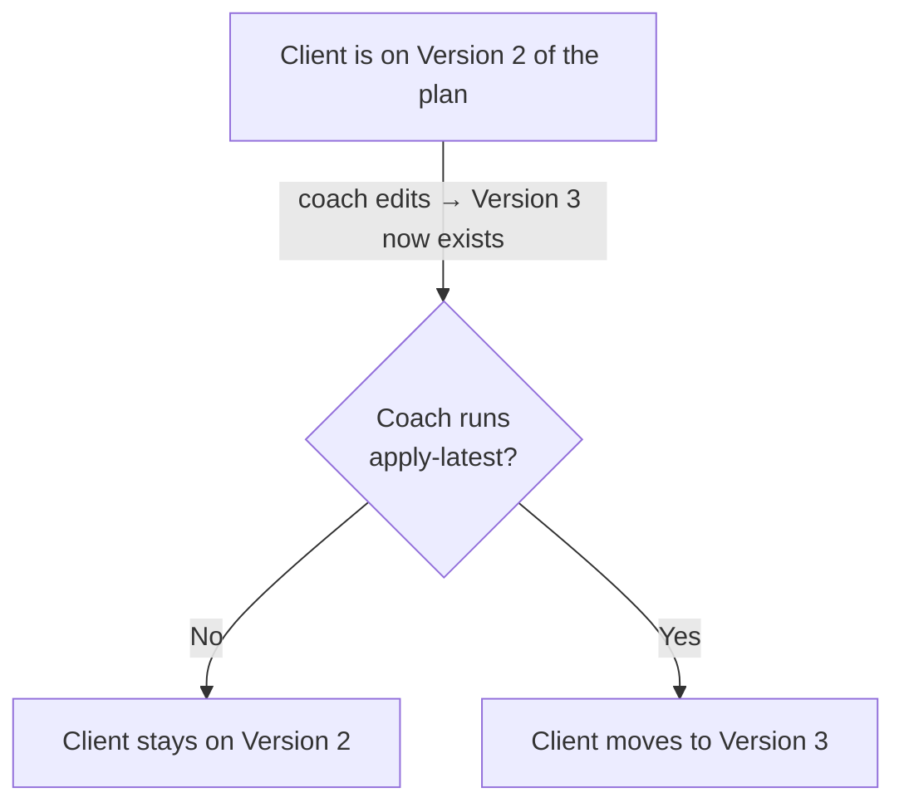
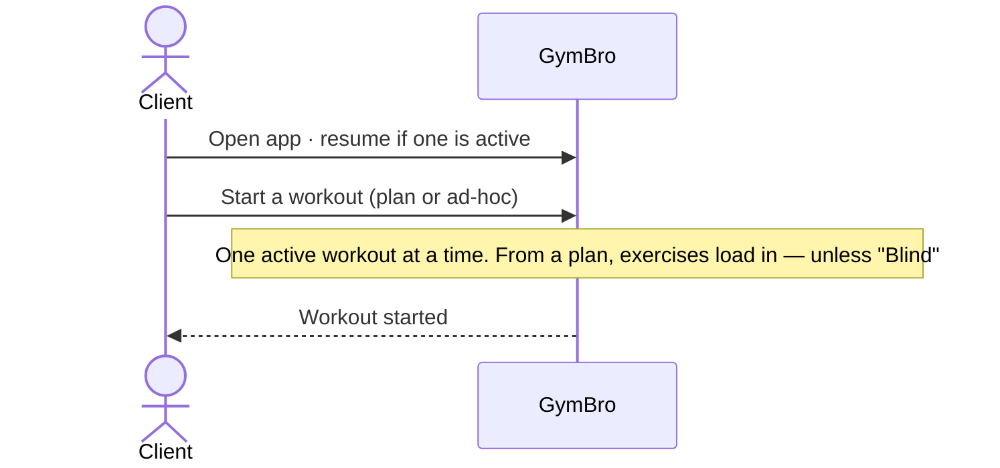
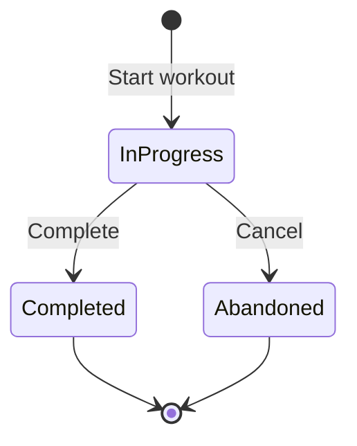

# User Flows

The end-to-end business flows as implemented — the real sequence of steps and which endpoint each one hits.

**Related:** [BUSINESS_RULES.md](BUSINESS_RULES.md) · [PERMISSIONS.md](PERMISSIONS.md) · [ARCHITECTURE.md](ARCHITECTURE.md)

## Actors

| Actor | Who | Key permission gate |
|---|---|---|
| **New user** | Anyone hitting `/register` | none (anonymous) |
| **Owner** | Coach; owns a tenant | `PlanCreate`, `PlanAssign`, `InviteCreate` |
| **Client / Trainee** | Joined a coach's tenant via invite | `WorkoutLogCreate` (logs own sessions) |
| **Platform Admin** | `is_admin` claim | bypasses tenant + soft-delete filters |

Tenant context comes from the `X-Tenant-Id` header validated by `TenantResolutionMiddleware`, not the JWT. Static
permissions are checked in `AuthorizationBehavior`, row-level rules in handlers (see [PERMISSIONS.md](PERMISSIONS.md)).

## The big picture

Coach does ③–④ · Client does ⑤–⑦ · the first two steps are shared.

## 1. Onboarding (register → workspace bootstrap → invite → join)

Every account owns one workspace as Owner. Registration takes no invite code; pairing a coach and client is a
separate step.

**Auth surface** (`AuthController`, all under `/api/auth`):

| Endpoint | Auth | Returns | Notes |
|---|---|---|---|
| `POST /register` | anon | `{token}` | publishes `UserRegisteredNotification` → User + Owner workspace; also sets the refresh cookie |
| `POST /login` | anon | `{token}` | claim-based; no tenant in token; also sets the refresh cookie |
| `GET /me` | JWT | `{userId, name, email, isPlatformAdmin}` | |
| `POST /change-password` | JWT | 204 | |
| `POST /forgot-password` | anon | `{success:true}` | always succeeds (no account enumeration); sends reset mail via `IEmailSender` (real SMTP when configured; without SMTP the dev logger records only masked recipient + subject — the body/token is never logged; non-Development hosts no-op) |
| `POST /reset-password` | anon | 204 | `{email, token, newPassword}`; ASP.NET Identity validates the token |

Token endpoints (`refresh`, `logout`, `logout-all`) and the access/refresh lifecycle are owned by
[AUTHENTICATION.md](AUTHENTICATION.md).

**Invites** — two ways to mint a code, one way to redeem:

| Endpoint | Who | Effect |
|---|---|---|
| `POST /api/invites/generate` | Owner (`InviteCreate`) | shareable `{code}` |
| `POST /api/tenants/invite {email}` | Owner (`InviteCreate`) | email-targeted `{code}` (same entity) |
| `GET /api/invites` | Owner | list active invites |
| `DELETE /api/invites/{code}` | Owner | revoke |
| `POST /api/invites/join {code}` | any authenticated user | creates `UserTenantRole`, returns `{tenantId}` |

Code: **8 chars** from `ABCDEFGHJKLMNPQRSTUVWXYZ23456789` (no `0/O/1/I`), cryptographic RNG, **7-day expiry,
single-use, always grants Client**. Re-joining a tenant you already belong to is rejected.

## 2. Plan authoring (immutable versioning)

A plan is assignable the moment it is created (no "publish"). Both metadata (`PUT /{id}`) and structure
(`PUT /{id}/structure`) edits clone a brand-new `WorkoutPlan` row (`Version+1`, same `TemplateId`) — they never
mutate in place. Older versions stay frozen as history. Each PUT returns the **new version id** (`200 { id }`),
and the builder save sends metadata **and** structure in the single `…/structure` call (one save = one version);
the client re-points to the returned id before its next edit. Chaining `PUT /{id}` then `PUT /{id}/structure`
on the same id is wrong — the first forks a newer version, so the second hits `409`. See [BUSINESS_RULES.md](BUSINESS_RULES.md).

Plan structure sent to `…/structure` (`ReplaceWorkoutPlanStructureCommand`) is a tree of
`Workouts[] → Exercises[]{exerciseId, order} → Sets[]{setType(Warmup|Working|Drop|Amrap), targetReps?,
targetWeightKg?, targetRpe?, targetDurationSeconds?, restSeconds, order}`. Lifecycle and the `(TemplateId, Version)`
constraint: [BUSINESS_RULES.md](BUSINESS_RULES.md) · [DATABASE.md](DATABASE.md).

## 3. Plan assignment (version pinning + visibility)

- Assignment fields: `traineeId, planId, startDate, frequencyDaysPerWeek (1–7), visibilityMode, hideExercises, hideSetsReps, hideFutureWorkouts, disableTraineeEditing, snapshotJson`.
- **Visibility modes** (`Full=1`, `Guided=2` default, `Blind=3`) are enforced server-side, filter-on-read. Existing assignments stay pinned to their version until `apply-latest`. All hide-flag defaults are false.
- **Self-train** is a one-click "Train this myself" on the Plans page (self-assign at `Full` visibility); the coach→client picker lists Clients only. Full rules: [BUSINESS_RULES.md](BUSINESS_RULES.md).

## 4. Start a session

- `source` is `FromAssignment` or `Adhoc`. `planAssignmentId` is required when `source == FromAssignment`; `plannedWorkoutId` drives the snapshot.
- Single-active-session rule (`GetActiveForTraineeAsync`): one in-progress session **per user across all gyms** — a second `POST /api/sessions` returns **409** even when it targets a different tenant. `GET /api/sessions/active` is self-scoped (no `X-Tenant-Id` required) and returns that one session wherever it lives.

## 5. Execution & completion

- Every mutation guards: session exists → `TraineeId == caller` → `Status == InProgress`. Terminal sessions are read-only.
- **Skip** is rejected (409) if the exercise already has logged sets. **Substitute** records `SubstitutedFromExerciseId`.
- **Estimated 1RM** is computed per Working set only: `weightKg × (1 + reps/30)`, rounded to 0.1, stored and recomputed on edit.
- "Cancel" = Abandon (keeps every logged set). `SessionCompletedEvent` is currently logged only. Details: [BUSINESS_RULES.md](BUSINESS_RULES.md).

## 6. Progress tracking

- There is **no `/api/reports` and no Reports module**. The trainee's own progress is served by the `api/me`
  read models (§7) or computed in the SPA from the session list; coach reporting reads `GET /api/sessions`.
- `GET /api/sessions` returns per-session working-set **volume** (Σ weight×reps), **PR count**, and plan context (program name, week #, frequency). Viewing other trainees' sessions needs `WorkoutLogViewAll`; otherwise the list is scoped to the caller.
- The logs page and active-session view compute progress %, weekly totals, and grouping entirely with Angular `computed()` signals.

## 7. Unified personal training (`api/me`)

A user can be an Owner (coach) in one gym and a Client (trainee) in another. The `api/me/*` read models give each
user **one** training history/progress view **across every gym they belong to**, independent of the active
`X-Tenant-Id`. They are **self-scoped** (always `currentUser.UserId`, never a client-supplied id) and read the
caller's own data via a deliberate, audited tenant-filter bypass (`QueryOwnAcrossGyms`).

| Endpoint | Returns |
|---|---|
| `GET /api/me/sessions` | own workout history across all gyms (paged; same shape as `GET /api/sessions`, with cross-gym program/week/weekly-goal context) |
| `GET /api/me/sessions/{id}` | own session detail; another user's id → **404** (never a leak). PR flags use lifetime cross-gym prior-bests |
| `GET /api/me/records` | lifetime PRs — best estimated-1RM per lift across all gyms |
| `GET /api/me/progress` | weekly volume/frequency analytics across all gyms |

These power the trainee/personal experience in the SPA. The **coach** view of a gym's members stays on the
tenant-scoped `GET /api/sessions` (`WorkoutLogViewAll`) — no cross-gym visibility. Authorization:
[PERMISSIONS.md](PERMISSIONS.md).
