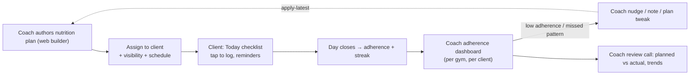

# Nutrition — Reporting, Analytics & Coach/Client Workflow

How today's check-offs become longitudinal insight, who sees what, and the workflow that closes the
coach⇄client loop. The reporting *infrastructure* is reused from the workout side; the *opportunities* are where
nutrition's rich-by-design data pays off.

**Related:** [DOMAIN_MODEL.md](DOMAIN_MODEL.md) (the durable data) · [API_AND_PERMISSIONS.md](API_AND_PERMISSIONS.md)
(read surfaces) · [USER_FLOWS.md](../USER_FLOWS.md) (the workout analogue).

> **Status.** The **snapshot capture on logs is built** — every `LoggedItem` denormalizes name + macros at log
> time, so the historical data described here is accruing today. The **`summary`/`adherence` endpoints and the
> aggregation handlers are designed, not built** — no `/api/me/nutrition/summary` or `/api/nutrition/adherence`
> exists yet.

## 1. Reporting strategy — reuse the "no Reports module" model

GymBro deliberately has **no `/api/reports` and no Reports module** ([USER_FLOWS.md](../USER_FLOWS.md) §6):
the trainee's progress is served by `/api/me/*` **read models** or computed client-side with `computed()` signals
/ pure-Dart functions; the coach view reads the tenant-scoped list endpoint. Nutrition follows this **exactly**:

- **Trainee analytics** → `GET /api/me/nutrition/summary` (a read model: adherence %, streak, macro trend over a
  window) + client-side derivation (`nutrition_adherence.dart`, Angular `computed()`), the same way session
  progress is computed.
- **Coach analytics** → `GET /api/nutrition/adherence?traineeId=&from=&to=` (tenant-scoped, `NutritionLogViewAll`),
  the nutrition twin of `GET /api/sessions`.
- **Read models finalized via the outbox.** `AdherencePct`/streak are computed at **day-close** and stored on
  `DailyNutritionLog` (so list reads are cheap), then `DailyLogClosedEvent` lets future consumers recompute richer
  aggregates out-of-band — the `PrCount`-at-complete + `SessionCompletedEvent` pattern. No synchronous heavy
  analytics on the write path.

**Why preferred:** it matches the platform's proven, low-infrastructure analytics approach (cheap stored
read-models + client derivation + an outbox seam for heavier future work), so nutrition reporting needs **no new
reporting subsystem**. If a dedicated analytics store/warehouse is ever justified by scale, the outbox events are
already the integration point — but we don't build it preemptively (the master-data "don't add an engine until
scale demands it" discipline).

## 2. The metrics that fall out for free

Because every `LoggedItem` is an **immutable, denormalized, status-bearing** fact and the `MetricEntry` spine
captures longitudinal signals, the brief's analytics list is mostly a matter of *querying data already captured* —
not new instrumentation:

| Insight (from the brief) | How it's derived from the model | Available |
|---|---|---|
| **Nutrition adherence** | completed / (completed+skipped+missed) per day, partitioned planned-only | MVP (stored on day) |
| **Meal completion rate** | `LoggedItem.Status` counts per meal slot over time | MVP |
| **Supplement consistency** | same, filtered to `FoodKind = Supplement` | MVP |
| **Missed vs skipped** | distinct statuses by design (Decision in [DOMAIN_MODEL §2.4](DOMAIN_MODEL.md)) | MVP |
| **Planned vs actual** | planned snapshot (`SnapshotJson`) vs logged items; macro snapshots vs targets | MVP (basic), richer later |
| **Habit / streak tracking** | consecutive days with adherence ≥ threshold | MVP |
| **Training-day vs rest-day nutrition** | `DailyNutritionLog` joined to the day's `isTrainingDay` classification (already used by the schedule) | Phase 2 |
| **Weekly / monthly trends** | windowed aggregates over `DailyNutritionLog` + `MetricEntry` | Phase 2 |
| **Macro/calorie intake** | sum denormalized macro snapshots across logged items | Phase 2 (data captured from MVP) |
| **Body-comp / weight trend** | `MetricEntry` series (BodyWeight, BodyFatPct, measurements) | Phase 2 |
| **Recovery/sleep/energy/mood/digestion correlations** | `MetricEntry` series cross-referenced with adherence/training | Phase 3 |
| **Nutrition insights / AI recommendations** | the above feature set → prompt grounding / model input | Phase 3+ |

The strategic point: **MVP demands almost nothing of the user beyond a tap, yet every Phase-2/3 analytic reads
data that the tap already captured.** That is the entire reason for completion-first logging + denormalized
snapshots + the metric spine — the design *front-loads* data richness so later phases are query-and-visualize, not
re-instrument-and-migrate.

## 3. Coach ⇄ client workflow

- **Authoring** is portal-first (web builder), assignment carries the visibility dial (Full/Guided/Blind +
  hide-macro-targets) so a coach can run **behaviour-only** clients (hide numbers) or **data-driven** clients
  (show targets) — the same coaching flexibility the workout visibility modes provide.
- **Monitoring** is the coach adherence dashboard: a gym roster with each client's current streak + 7/30-day
  adherence + missed-item flags, drilling into any day. Reuses the Workout-Log timeline UI and the
  tenant-scoped read with `NutritionLogViewAll`, bounded to the coach's own gym by the row-level guard.
- **Compliance monitoring** = the missed-vs-skipped distinction surfaced: a client with rising *missed* (ghosting)
  triggers a different nudge than rising *skipped* (deviating on purpose). `DailyLogClosedEvent` can drive a coach
  digest (later: push/email).
- **Self-training Owners** see their own adherence in the same surfaces (the cross-gym `/api/me` read), since an
  Owner-with-no-clients is just a self-coached athlete.

**Data ownership in the loop:** the client owns the data; the coach sees it only within their gym membership and
only the visibility-permitted fields ([API_AND_PERMISSIONS §6](API_AND_PERMISSIONS.md)). The workflow never
exposes one client's nutrition to another, and a coach's view ends when membership ends.

## 4. Why this generates a durable coaching advantage

The combination — **prescription (plan) + daily adherence (log) + body/recovery signals (metrics) + the
training-day context (cross-module)** — is data almost no consumer-logging app has, because consumer apps lack the
**coach-prescribed plan** to measure *against*. GymBro's nutrition data is **planned-vs-actual with a coaching
relationship attached**, which is exactly the substrate for:

- **Adaptive plans** — apply-latest a plan tweak when adherence/biometrics indicate.
- **AI coaching** — the `MetricEntry` + adherence + training-day series is structured prompt-grounding input
  (the master-data architecture already reserves nullable AI fields as the additive pattern).
- **Outcome attribution** — correlate adherence with body-comp/recovery trends per client, the long-term moat.

None of this is built in MVP — but the **data model makes all of it a later read, not a later redesign**, which is
the explicit mandate of the brief.
