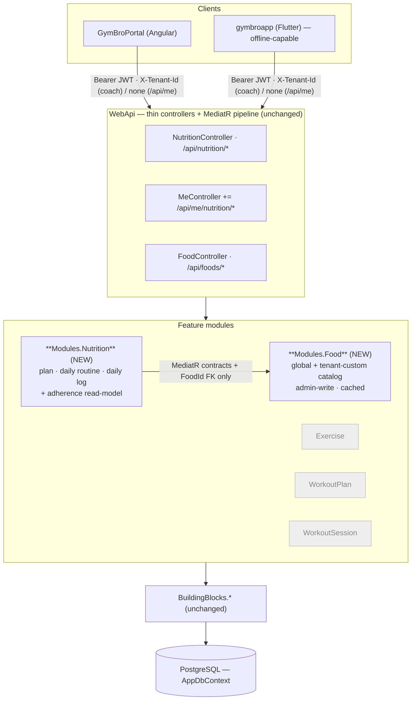

# Nutrition — Recommended Architecture & Key Decisions

How the nutrition feature fits the modular monolith, where each piece lives, and the load-bearing decisions —
each with **why / how it aligns / alternatives / why preferred**.

**Related:** [DOMAIN_MODEL.md](DOMAIN_MODEL.md) · [DATABASE.md](DATABASE.md) · the existing
[ARCHITECTURE.md](../ARCHITECTURE.md) is the convention this proposal obeys.

## 1. The shape — same monolith, two new modules

Nutrition adds **no new process, no new datastore, no new deployment**. It is two feature modules inside the
existing ASP.NET Core modular monolith, persisting to the existing `AppDbContext` (one new migration on the
**App** chain — never the Identity chain), reached through the existing thin-controller → MediatR →
`Result<T>` pipeline, with the same tenant-isolation and outbox machinery.

### Decision 1 — split Food (catalog) from Nutrition (plan + log)

**Recommendation:** two modules. `Modules.Food` owns the catalog and a tiny contract surface
(`ResolveFoodSummariesQuery`, `ValidateFoodIdsQuery`, `ResolveServingNutritionQuery`). `Modules.Nutrition` owns
plans, assignments, daily logs, and the adherence read-model, and depends on `Modules.Food` **contracts only**.

- **Why:** the catalog and the logging engine have different lifecycles, owners, and write-paths — catalog is
  global/admin-curated and read-heavy (cacheable); plans/logs are tenant-scoped, user-written, and high-churn.
  They also have different licensing/provenance concerns (catalog) vs none (logs).
- **How it aligns:** this is the **exact existing split** — `Exercise` is its own module, distinct from
  `WorkoutPlan`/`WorkoutSession`, which reference it only via `ResolveExerciseNamesQuery` + `ExerciseId`. The
  build-enforced `ModuleBoundaryConventionTests` (no cross-module `.Entities` access) makes this the *only*
  compliant way to let logging read foods. *(See [ARCHITECTURE.md](../ARCHITECTURE.md) "Module boundary rules".)*
- **Alternatives considered:** (a) **one mega "Nutrition" module** holding catalog + plan + log — rejected: it
  conflates an admin-curated shared catalog with tenant write-data and violates the boundary the platform
  enforces for exactly this case. (b) **three modules** (Food / NutritionPlan / NutritionLog, fully mirroring the
  workout trio) — viable, but a nutrition plan and its daily log are *more* tightly coupled and smaller than the
  workout pair (a plan day and a log day share a meal vocabulary), so the seam between them buys little and costs
  an extra cross-module contract. **Two is the right granularity.**
- **Why preferred:** maximal reuse of the proven Exercise-vs-Workout boundary, minimal new contract surface,
  build-enforceable.

## 2. The reuse spine — plan → assignment → daily log

The heart of the feature maps 1:1 onto the workout spine. This is the single biggest reuse win and the reason
nutrition is low-risk.

| Workout (exists) | Nutrition (proposed) | Shared mechanism |
|---|---|---|
| `WorkoutPlan` — versioned template (`TemplateId`+`Version`), immutable edits clone a new version | `NutritionPlan` — *same* versioning, same delete-guard-while-assigned | immutable version chain, latest-non-deleted read |
| `PlanWorkout → PlanWorkoutExercise → PlanWorkoutExerciseSet` | `PlanMeal → PlanMealItem` (+ `PlanSupplement`) | nested template tree, order preserved, deep-copy on version |
| `PlanAssignment` — pins `PlanId+PlanVersion`, `SnapshotJson`, visibility flags, `frequencyDaysPerWeek` | `NutritionPlanAssignment` — pins version, `SnapshotJson`, visibility, **`Schedule`** (recurrence, see Decision 3) | version pinning, `apply-latest`, pause/resume |
| `WorkoutSession.Start` snapshots the planned workout, seeds `PerformedExercise` rows | `DailyNutritionLog` (per calendar date) snapshots the *applicable* planned day, seeds `LoggedItem` rows | snapshot-on-touch + denormalize |
| `PerformedExercise.Status` (InProgress/Completed/Skipped/Substituted) | `LoggedItem.Status` (Planned/Completed/Skipped/Substituted/Missed) | per-item planned-vs-actual |
| `PrCount` finalized at Complete + `SessionCompletedEvent` → outbox | `AdherencePct`/streak finalized at day-close + `DailyLogClosedEvent` → outbox | read-model rollup via transactional outbox |

### Decision 2 — `DailyNutritionLog` snapshots the plan *per date, on first touch* (not pre-materialized, not pure-computed)

The trickiest modelling question: a nutrition plan recurs **every day**, so how do planned days become loggable
days? Three candidate strategies:

- **(a) Pre-materialize** a `DailyNutritionLog` row for every date in the assignment window up front. *Rejected:*
  unbounded row growth (an open-ended plan ⇒ infinite rows), wasteful for days the user never opens, and a
  nightmare when the plan version changes mid-window.
- **(b) Pure-computed / never persist the plan side** — derive "today's planned meals" live from the assignment
  on every read, persist only the user's check-offs. *Rejected:* loses the **point-in-time snapshot** guarantee
  (editing the plan would retroactively rewrite what "yesterday's plan" was), and breaks adherence history when a
  food is renamed/retired. This is precisely the integrity problem the workout snapshot was designed to solve.
- **(c) Snapshot-on-touch (recommended):** the `DailyNutritionLog` for date *D* is created lazily the first time
  the trainee opens day *D* (or the first time an item is logged for *D*). At creation it resolves the assignment
  active on *D*, evaluates the recurrence (which meals apply to *D* given weekday + training/rest classification),
  snapshots them into `SnapshotJson`, and seeds one `LoggedItem` per planned item — **exactly** how
  `WorkoutSession.Start` snapshots `SnapshotJson` and seeds `PerformedExercise`.

  - **Why:** bounded storage (one row per *day the user actually engaged with*), point-in-time integrity (a later
    plan edit never rewrites a past day), and a uniform read model — every day, planned or ad-hoc, is one
    `DailyNutritionLog` with `LoggedItem`s.
  - **How it aligns:** it is the snapshot-and-denormalize pattern the platform already trusts for durable history
    ([BUSINESS_RULES.md](../BUSINESS_RULES.md) "Durable session history"; [DATABASE.md](../DATABASE.md)
    "Load-bearing constraints"). The `jsonb SnapshotJson` column, the seed step, and the denormalized
    name/nutrition are all proven mechanics.
  - **Alternatives:** see (a)/(b) above.
  - **Why preferred:** it is the only option that gives both bounded growth *and* historical integrity, and it
    reuses an existing, tested mechanism instead of inventing recurrence-materialization.

  > One refinement over the workout model: a workout day is *started* explicitly; a nutrition day should
  > **auto-open at local midnight on first app interaction** so reminders and the "today" view have a row to bind
  > to without a manual "start my day" tap. The creation is still lazy (no background job pre-creating rows) — it
  > just triggers on first read of an un-opened current/past date rather than on an explicit start action.

### Decision 3 — recurrence lives on the assignment as a structured `Schedule`, evaluated client- and server-side from a shared rule set

Workouts have only `frequencyDaysPerWeek` (an integer the trainee satisfies by manually starting sessions).
Nutrition genuinely recurs by **time-of-day and day-type**, so we need real recurrence — the platform's first.

**Recommendation:** model recurrence as declarative data on `NutritionPlanAssignment` (and defaultable on the
plan), never as generated rows:

- Each `PlanMeal` carries a `ScheduledTime` (local `TimeOnly`, e.g. 07:30) and a `DayApplicability`
  (`EveryDay` | `TrainingDay` | `RestDay` | explicit `DaysOfWeek` bitmask).
- "Is today a training day?" is resolved from the trainee's **workout** signals (an active workout
  assignment's `frequencyDaysPerWeek` / a completed session today) via a **MediatR cross-module query**
  (`IsTrainingDayQuery` owned by WorkoutSession) — *this is the one meaningful new cross-module read between the
  nutrition and workout contexts, and it is exactly the kind of contract the architecture sanctions.*
- The **evaluation rule** ("given a date + day-type, which planned meals apply, in what order, at what times")
  lives once in `BuildingBlocks.Shared.Nutrition` (`NutritionScheduleRules`) and is **mirrored by the Angular and
  Flutter clients** — the identical pattern to `ExerciseTrackingRules` in `BuildingBlocks.Shared.Tracking` being
  mirrored by both clients ([BUSINESS_RULES.md](../BUSINESS_RULES.md) "Tracking modes").

  - **Why:** declarative recurrence is inspectable, editable, and reversible; generated rows are not. Sharing the
    rule set keeps the on-device reminder scheduler, the server snapshot step, and the web UI from drifting.
  - **How it aligns:** mirrors the shared `ExerciseTrackingRules` matrix and the visibility-flag-on-assignment
    model. The training-day lookup uses the established cross-module-query mechanism.
  - **Alternatives:** an RRULE/iCalendar string (overkill — nutrition recurrence is "daily with day-type
    variants", not arbitrary calendar math, and RRULE has no native training/rest concept); a cron expression
    (opaque to users, no day-type); per-day generated rows (Decision 2(a), rejected).
  - **Why preferred:** smallest expressive model that covers the real cases (daily, weekday-specific,
    training/rest split), shareable across three runtimes, and free of materialization.

## 3. Where the genuinely new infrastructure goes

Three capabilities the platform has never had. Each is designed to be **additive and isolated** so it cannot
destabilize existing features. Full designs in [REMINDERS_AND_OFFLINE.md](REMINDERS_AND_OFFLINE.md); the
architectural placement:

- **Offline logging (Flutter only, MVP).** A local persisted **mutation queue** (`drift` — SQLite) holding
  pending `LoggedItem` writes with **client-generated GUID ids** and an **idempotency key**. The server exposes
  **idempotent upserts** (a re-sent create with the same client id is a no-op success). This is a *client*
  concern — **the API stays stateless and unaware of "offline"**; it just accepts client-supplied ids and
  upserts. *(Decision rationale: REMINDERS_AND_OFFLINE §3.)*

- **Reminders (client-local, MVP).** The shared `NutritionScheduleRules` produce today's meal times on-device;
  the client registers **local OS notifications** (`flutter_local_notifications`). **No server, no device-token
  table, no FCM for MVP.** *(REMINDERS_AND_OFFLINE §1.)*

- **Server push + dispatch (designed, deferred).** For coach nudges, cross-device, and adherence alerts: a
  `DeviceToken` table, an FCM/APNs/Web-Push sender behind an `INotificationSender` abstraction, and a
  **timezone-aware `NutritionReminderDispatchService` hosted service** that reuses the existing
  **transactional-outbox + `OutboxProcessor`** delivery guarantees. Placed alongside the existing hosted services
  (`OutboxProcessor`, `RefreshTokenCleanupService`) so it inherits multi-instance safety. *(REMINDERS_AND_OFFLINE
  §2.)*

### Decision 4 — offline-first for nutrition logging, even though workouts are online-only

**Recommendation:** add an offline mutation queue to the Flutter nutrition logger; leave the web portal
online-first; leave workouts unchanged.

- **Why:** the two logging activities have different physics. A workout session is *one focused, real-time,
  coach-monitorable event* on the gym floor; brief connectivity gaps are tolerable and the platform deliberately
  chose online-only ([gymbroapp ARCHITECTURE §11](../../../gymbroapp/docs/ARCHITECTURE.md)). Nutrition logging is
  *many tiny interactions spread across the whole day* — breakfast at home, a supplement on the commute, lunch in
  a basement food court. If a single skipped-because-offline tap is lost, daily adherence data (the entire point
  of the feature) is corrupted. **Offline tolerance is a feature requirement here, not a nicety.**
- **How it aligns:** it does **not** weaken any server invariant — tenant isolation, `Result<T>`, and validation
  are untouched. It mirrors the platform's existing *idempotency* instincts (the outbox is at-least-once and
  "handlers must be idempotent"; the session start-handler already tolerates a duplicate-insert race). We extend
  that idempotency philosophy to the write API.
- **Alternatives:** (a) **online-only like workouts** — rejected for the data-integrity reason above. (b)
  **full bidirectional CRDT sync** — rejected as massive over-engineering: nutrition writes are append-mostly and
  single-author (a user logs their own day), so last-write-wins per item + idempotent upsert is sufficient. (c)
  **queue in memory only** — rejected: a killed app loses the queue; it must be persisted.
- **Why preferred:** matches the activity's real connectivity profile, scoped to exactly the client that needs it
  (mobile), with the smallest correctness primitive (idempotent upsert) rather than a sync framework.

## 4. Decisions 5–7 (summarized; detailed in their owning docs)

- **Decision 5 — completion-first logging, nutrition captured silently.** MVP asks "did you eat the planned
  item?" (one tap), not "enter grams/macros." Macros are denormalized from the catalog at log time so the data is
  rich without user burden. *Why preferred:* it is the only way to satisfy *both* "extremely fast daily logging"
  *and* "rich long-term data" — the two halves of the brief that naively conflict. Detail: [DOMAIN_MODEL §6](DOMAIN_MODEL.md).

- **Decision 6 — a flexible `MetricEntry` spine, not bespoke tables per signal.** Body weight, water, sleep,
  mood, photos, and future wearable streams are one additive series keyed by a `MetricType` lookup. *Why
  preferred:* the brief's "future expansion" list is long and open-ended; a table-per-signal model guarantees
  repeated migrations, while one typed series absorbs new signals as data, not schema. Detail:
  [DOMAIN_MODEL §8](DOMAIN_MODEL.md).

- **Decision 7 — trainee data is self-scoped + cross-gym via `/api/me/nutrition/*`.** A person's nutrition is
  theirs across every gym; coaches monitor per-gym. *Why preferred:* it reuses the audited `QueryOwnAcrossGyms`
  bypass and the dual-surface model the session feature already proves. Detail: [API_AND_PERMISSIONS §3](API_AND_PERMISSIONS.md).

## 5. What explicitly does *not* change

To bound risk, the proposal touches **nothing** in these areas:

- Auth/token lifecycle, `IdentityDbContext`, the refresh/revocation machinery — untouched.
- Tenant resolution middleware, the EF global-filter engine, `AuthorizationBehavior`, `PlatformAdminBehavior` —
  reused as-is; we only *add* permission enum values and `ITenantAuthorizedRequest` markers.
- The workout modules — `IsTrainingDayQuery` is a new *read* contract they expose; no workout write-path changes.
- Deployment topology, CI/CD, the compose stack — nutrition ships in the same images. The only new optional config
  is push credentials (later phase) and a `Nutrition:*` block for reminder defaults.

## 6. Risk posture (full table in [ROADMAP.md](ROADMAP.md))

The low-risk 80% is reuse (modules, persistence, CQRS, tenancy, the plan/log spine, both clients' state
patterns). The risk concentrates in the new 20%: **recurrence correctness across timezones**, **offline
sync/idempotency**, and **notification reliability** — each isolated to its own subsystem and each phaseable so
the MVP can ship the reuse spine *before* the hard parts land (the schedule can be "all meals shown for today" and
reminders can be off in the first internal release). See the phased roadmap.
