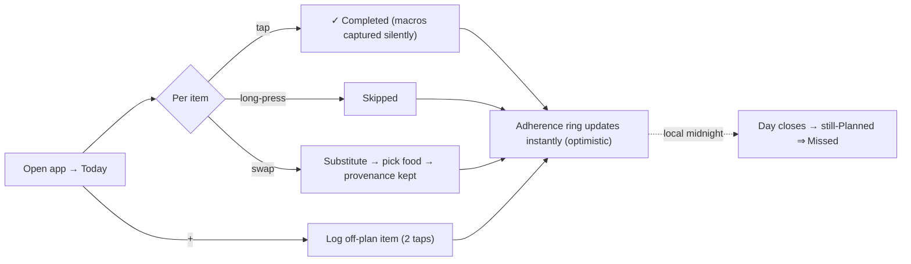

# Nutrition — Client UX, Navigation, State & Reusable Components

How the feature surfaces in both clients. The thesis: **fast daily logging on mobile, rich review on web**, both
built almost entirely from existing components and state patterns.

**Related:** [Flutter ARCHITECTURE](../../../gymbroapp/docs/ARCHITECTURE.md) · [Portal ARCHITECTURE](../../../GymBroPortal/docs/ARCHITECTURE.md)
· [REMINDERS_AND_OFFLINE.md](REMINDERS_AND_OFFLINE.md) (the mobile offline/notification specifics).

## 1. The core interaction — "today" as a checklist

The whole MVP hinges on one screen: **Today's Nutrition**. It is a vertically-grouped checklist of the day's
planned meals (by `ScheduledTime`) and supplements, each row one tap to **Complete**, with a long-press/secondary
for **Skip** / **Swap**. A floating **+** logs an off-plan item in the same two taps (pick food → confirm). A
top **adherence ring** shows meals-hit / planned. This is intentionally the nutrition twin of the workout
**active-session** screen — a focused, single-purpose logging surface.

Design principle borrowed from the brief and the existing log redesign: **logging must be sub-10-seconds and
work one-handed**; the rich data (macros, timing, trends) accrues invisibly and is reviewed elsewhere.

## 2. Flutter (gymbroapp) — the primary logging client

### Navigation

Add a **`Nutrition` tab** to the trainee branch of the existing `StatefulShellRoute.indexedStack`. Today's tab
order is **log · plan · progress** (trainee) / **clients · coach-plans** (coach) / **profile** (shared). Proposed:

- Trainee: **log · nutrition · progress · profile** (nutrition takes a primary tab — it is a daily-return surface;
  "plan" view folds into a header action since trainees consult plans less than they log). *Tab count stays at 4
  for trainees — we promote nutrition, not bloat the bar.*
- Full-screen routes above the shell (the established pattern for `/session/:id`): `/nutrition/day/:date` (a past
  day detail), `/nutrition/food-search` (the food picker sheet can also be a route), `/nutrition/metric/:type`
  (log a metric / view its series). Role-adaptive redirect bounces coaches off trainee-only nutrition logging,
  same guard mechanism as today.

Coach gets a **client nutrition** view reached from the existing client-monitor screen (a tab/segment alongside
workout history) — no new top-level coach tab needed for MVP.

### State (Riverpod — mirrors the session feature)

- `nutritionTodayProvider` — `FutureProvider.autoDispose<DailyLog>`; the today read (lazily-created). Watches
  `activeTenantIdProvider` so a workspace switch resets it (the ported "no cross-workspace bleed" rule).
- `nutritionDayProvider.family<DailyLog, String date>` — a specific day.
- `nutritionSummaryProvider` — adherence/streak/macro trend (cross-gym `/api/me`).
- `NutritionLogController extends AutoDisposeNotifier<…>` — owns the **optimistic mutations**: tap → update local
  state immediately → enqueue the write (offline queue) → `ref.invalidate` on confirm. This is the
  `LiveSessionController` pattern extended with a persistent queue (see
  [REMINDERS_AND_OFFLINE §3](REMINDERS_AND_OFFLINE.md)).
- **Pure-Dart derivations** in `lib/domain/` (no Flutter imports), exactly like `session_metrics.dart` /
  `session_grouping.dart`:
  - `nutrition_adherence.dart` — `adherencePct(items)`, `streak(days)`, `macroTotals(items)`.
  - `nutrition_schedule.dart` — the client mirror of `BuildingBlocks.Shared.Nutrition.NutritionScheduleRules`
    (today's applicable meals + times), used both to render "today" and to schedule local reminders.
  - These are unit-tested with no device, like the existing 31 domain tests.

### Data layer

- `data/models/nutrition_models.dart` — hand-mirrored DTOs with tolerant `WireEnum` parsing
  (`LoggedItemStatus.parse`, `MealType.parse`), `fromJson`/`toJson` using the `core/utils/json.dart` helpers —
  the exact `session_models.dart` convention.
- `data/repositories/nutrition_repository.dart` — `/api/me/nutrition/*` for trainee, with the **same 404→
  tenant-scoped fallback shim** the session repo uses for servers predating `MeController`. Methods: `today()`,
  `day(date)`, `logItem(req)`, `substitute(...)`, `metric(...)`, `summary(...)`, `syncBatch(queue)`.

### Reusable widgets (almost all exist)

| Need | Existing widget (`shared/widgets/`) | New? |
|---|---|---|
| Meal/item rows, cards | `GbCard`, `cards.dart`, `session.dart` set-card style | reuse / light variant |
| Tap-to-complete control | `buttons.dart` (`GbButton`), the stepper in `session.dart` | reuse |
| Adherence ring | the completion-ring concept (portal has one; mobile uses custom painters per §11) | small new painter |
| Async/empty/error/skeleton | `AsyncValueView` / `EmptyState` / `ErrorRetry` / `GbSkeleton` (`feedback.dart`) | reuse verbatim |
| Stats / macro tiles | `stats.dart` | reuse |
| Food-picker bottom sheet | `sheets.dart` | reuse shell + new content |
| Chips (meal type, skipped/missed) | `chips_badges.dart` | reuse |
| Headers | `headers.dart` | reuse |
| Tokens / theme | `context.gb.*`, `App*` token classes; **zero hex** | reuse |

Net new mobile UI is small: an adherence-ring painter, the food-search content, and the today-checklist layout —
everything else is the existing kit.

## 3. Angular (GymBroPortal) — coach authoring + review

The web portal is **coach-first** for nutrition (mirrors how plan *authoring* is portal-first for workouts). Three
surfaces, each cloning an existing one:

### Plan builder — clone the workout plan-builder

A **nutrition plan builder** at `features/workspace/nutrition-plans/` mirrors `features/workspace/plans/plan-builder`:
a full-page editor (`app-ui-page-container` → stacked `app-ui-panel-card` sections → `app-ui-page-sticky-footer`
with outlined-cancel + primary-save). Meals are sections; items are rows with a food autocomplete + serving +
quantity; the save sends the whole structure in one `…/structure` call (one save = one version). The immutable-
versioning UX (each save re-points to the returned id) is reused wholesale.

### Assignment + visibility — clone plan-assignments

`features/workspace/nutrition-assignments/` mirrors `plan-assignments`: trainee picker (Clients only), visibility
mode (Full/Guided/Blind), hide-flags (HideMacroTargets/HideFutureDays/DisableTraineeEditing), start date, and the
**schedule editor** (per-meal time + day-type) — the one genuinely new control. "Follow this myself" reuses the
self-assign-at-Full button.

### Adherence review — clone the Workout-Log timeline

A coach **nutrition adherence** view reuses the `features/workspace/logs` session-first timeline pattern: filter
chips + Monday-anchored collapsible week-groups, but rows are *days* with an adherence ring instead of sessions
with a volume figure. The week grouping is the same `computed()` signal logic; tapping a day opens a
**nutrition-day-detail dialog** (clone of `session-detail-dialog`). Per-client drill-in lives beside the existing
`/workspace/clients/:clientId/workouts` read-only view.

A trainee can also self-log on web (the same today-checklist, read via `/api/me/nutrition/*` selected by
`currentRole()` — Owner→coach/tenant-scoped, otherwise personal — the exact `LogsComponent` source-selection
logic).

### State, services, components (all existing conventions)

- `NutritionPlanService`, `NutritionLogService` — `@Injectable({providedIn:'root'})` with `signal()`/`computed()`
  state, typed `HttpClient` against `/api`, `effect()` reset on tenant switch, dual `list()`/`listMine()` like
  `SessionService`. State lives in services; components are thin, OnPush, standalone, read service signals.
- **Reusable `shared/ui/` wrappers** — all reused: `app-data-table`, `app-page-header`, `app-button`, `app-input`,
  `app-select`, `app-form-field`, `app-ui-page-container`, `app-ui-page-sticky-footer`, `app-ui-panel-card`,
  `app-filter-bar`, `app-confirm-split-dialog`, `app-success-dialog`, `app-info-dialog`,
  `app-chip-removable-list`. The only candidate new wrapper is an **`app-time-picker`** for meal times if PrimeNG's
  isn't already wrapped — and a small **adherence-ring** presentational component (the completion-ring already
  exists in `logs/completion-ring/` and can be generalized).
- **`inv-*` tokens only**, no raw PrimeNG in feature templates, reactive forms for the new builder — the
  non-negotiables, unchanged.

## 4. Navigation summary (both clients)

| Client | Trainee entry | Coach entry |
|---|---|---|
| Flutter | **Nutrition** primary tab → Today checklist; full-screen day/metric routes | client-monitor screen → nutrition segment |
| Angular | `/workspace/nutrition` today + history (un-guarded personal, like trainee plans) | `/workspace/nutrition-plans` + `/nutrition-assignments` (`roleGuard(['Owner'])`); adherence under clients |

Routing reuses lazy routes + `authGuard`/`roleGuard(['Owner'])`/`adminGuard()` (catalog admin) exactly as today.

## 5. Error handling (client)

- **Flutter:** `apiCall` → typed `ApiException` (`isConflict`/`isNotFound`/…); the UI branches as it does for the
  second-active-session 409. A `DailyLog.Closed` conflict (logging into a closed past day) surfaces a clear
  "this day is locked" message. Offline writes never error the UI — they queue (see offline doc).
- **Angular:** `errorInterceptor` shows a toast for unexpected errors and silently refreshes on 401; nutrition
  inherits both. Optimistic UI rolls back on a confirmed server rejection.
- **Optimistic-update discipline:** the tap updates local state first (instant ring movement); a server failure
  that *isn't* a transient/offline case rolls the item back and toasts — never a silent divergence.
