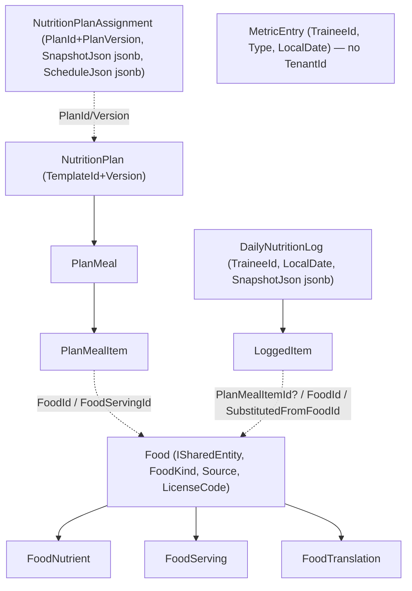

# Nutrition — Database Design

Tables, ownership, tenancy markers, load-bearing constraints, indexes, and migration plan. Follows the
conventions in the existing [DATABASE.md](../DATABASE.md) — read that first; this is the nutrition delta.

**All nutrition tables live on `AppDbContext`** (the domain chain), **never `IdentityDbContext`**. The feature is
**one additive migration on the App chain** (plus optional later migrations for push/offline). No Identity-chain
change.

## Entity ownership & access

| Entity (table) | Owner module | Writes | Markers / tenant filter |
|---|---|---|---|
| `Food` | Food | Food (admin for global; Owner for tenant-custom) | `ISharedEntity` (`TenantId null` = global OR `== header`) + `ISoftDelete` — **the Exercise rule exactly** |
| `FoodNutrient`, `FoodServing`, `FoodTranslation` | Food | Food | child of `Food`; hard-delete; inherit access via parent |
| `NutritionPlan`, `PlanMeal`, `PlanMealItem` | Nutrition | Nutrition (Owner) | `ITenantEntity` (`== header`) + `ISoftDelete` on root; children hard-delete |
| `NutritionPlanAssignment` | Nutrition | Nutrition (Owner) | `ITenantEntity` + `ISoftDelete` |
| `DailyNutritionLog` | Nutrition | Nutrition (trainee = owner) | `ITenantEntity` + `ISoftDelete`; **self-scoped reads bypass filter via `QueryOwnAcrossGyms`** (see below). `Source` column (`NutritionSource`: `FromAssignment` \| `Adhoc`) — a plan-less off-plan day is `Adhoc` (self-logged) |
| `LoggedItem` | Nutrition | Nutrition (trainee) | `ITenantEntity`; **hard-delete** (mirrors `PerformedSet`) |
| `MetricEntry` *(built — migration `Nutrition_MetricEntry`)* | Nutrition | Nutrition (trainee) | **`ISoftDelete` only, no tenant marker** — written on the self-scoped `/api/me` surface with no `X-Tenant-Id` and no assignment required, so there is no natural gym to stamp; repository scopes strictly by `TraineeId == currentUser.UserId` (the `DeviceToken` treatment, not the `DailyNutritionLog` one) |
| `DeviceToken` *(designed, not yet in schema — deferred phase)* | Nutrition (or a small Notifications module) | the device-registration handler | **no tenant marker** (a device belongs to a *user* across gyms) — scoped by `UserId` in repo, like `UserTenantRole` |

> **Tenant marker choice for logs.** `DailyNutritionLog` carries `ITenantEntity` (stamped with the
> gym the trainee logged under, for the coach's tenant-scoped view) **and** are read self-scoped cross-gym for the
> trainee via the sanctioned `IgnoreQueryFilters`+`TraineeId==currentUser` bypass — the *exact* dual treatment
> `WorkoutSession` already gets ([PERMISSIONS.md](../PERMISSIONS.md) "Unified personal reads"). A trainee in
> multiple gyms still has **one** nutrition timeline; each day row is stamped with whichever gym was active when
> it opened (typically their coach's gym).
>
> **Self-logged days keep `TenantId` non-null (no migration).** When a trainee logs off-plan food on a date no
> assignment governs, `NutritionDayProvisioner` opens a self-logged day (`Source = Adhoc`) stamped with the
> **active gym** (`ITenantContext.TenantId`) — the trainee write surface `/api/nutrition/log/*` is tenant-scoped,
> so the header tenant is present. A nutrition day is unique per `(trainee, date)` globally, so its `TenantId` is
> the gym active when it first opened. `TenantId` stays non-null, so the column requires no schema change and the
> EF tenant filter still hides the day from coaches in other gyms. No tenant in context → the write fails cleanly,
> no row is created.

## Relationships (physical)



App-enforced soft FKs (no DB FK), matching the existing `PlanSetId`/`ParentSetId` convention: `LoggedItem.
PlanMealItemId`, `LoggedItem.SubstitutedFromFoodId`. Hard FKs with `Restrict`: `PlanMealItem.FoodId → Food` (a
food in use can't be hard-deleted; it soft-deletes). Cascade (child of root): `PlanMeal→PlanMealItem`,
`DailyNutritionLog→LoggedItem`, `Food→FoodNutrient/FoodServing/FoodTranslation`.

## Load-bearing constraints

- **Plan versioning:** unique index `(TemplateId, Version)` filtered `IsDeleted = false` — *identical* to
  `WorkoutPlan`. `NutritionPlanAssignment` pins `PlanId + PlanVersion`. `SnapshotJson` and `ScheduleJson` are
  `jsonb`. Soft-delete of a plan version blocked while a live assignment pins it.
- **One live assignment per (trainee, plan):** unique **partial** index `(TenantId, TraineeId, PlanId)` filtered
  `IsDeleted = false` — the `PlanAssignment` rule reused. `IsActive` is pause/resume.
- **One log per (trainee, local date):** unique index on `DailyNutritionLog (TraineeId, LocalDate)`. This is the
  nutrition analogue of "one active session per user," but keyed by **date** (a person has exactly one nutrition
  day per calendar date) rather than by status. `LocalDate` is a `date` computed from the trainee's timezone at
  open time — **the timezone is captured on the row** (`ClientTimezone`, like `WorkoutSession.ClientTimezone`) so
  "what counts as that day" is pinned and auditable.
- **Durable history:** `LoggedItem` denormalizes `FoodNameSnapshot`, `ServingLabelSnapshot`, and the four
  headline-macro snapshots — captured at log time so catalog edits never rewrite a closed day (the
  `PerformedExercise.ExerciseName`+`TrackingType` durability pattern).
- **Ad-hoc vs planned:** `LoggedItem.PlanMealItemId IS NULL` ⇒ off-plan/one-off. Adherence math partitions on
  this. Set-count-style queries ("planned items hit") filter `PlanMealItemId IS NOT NULL`.
- **Status semantics:** `LoggedItem.Status ∈ {Planned, Completed, Skipped, Substituted, Missed}`. `Missed` is
  written only by the day-close routine; mutations are rejected once the day is closed (mirrors terminal-session
  read-only).
- **Catalog integrity (Food):** name required; `OwnerTenantId NULL ⇒ admin-authored`; nutrient amounts ≥ 0;
  serving grams > 0; `Source`+`LicenseCode` required (legal-clean guardrail, reused from the exercise catalog).
  Unique `(OwnerTenantId, Slug)` for stable identity.
- **Metric integrity** *(as built: append-only with NO unique index — the newest entry per type per day is
  "latest"; the lookup-driven uniqueness below is the deferred design)*: `MetricEntry` unique `(TraineeId, MetricTypeId, LocalDate)` for single-value-per-day
  signals (weight, body-fat); multi-value signals (water poured 6×) either sum into one row or relax the unique
  index per `MetricType.AllowMultiplePerDay` — modeled as a lookup flag so it's data, not schema.

## Hot-path indexes

Mirror the workout hot-path indexing philosophy:

- `DailyNutritionLog (TraineeId, LocalDate)` — unique, and the primary timeline read.
- `DailyNutritionLog (TenantId, TraineeId, LocalDate)` — the coach's per-gym client-day read.
- `LoggedItem (DailyNutritionLogId, Order)` — render a day in order (like `PerformedExercise (SessionId, Order)`).
- `LoggedItem (DailyNutritionLogId, Status)` — adherence rollup.
- `NutritionPlanAssignment (TenantId, TraineeId)` / `(TenantId, PlanId)` — reused from `PlanAssignment`.
- `MetricEntry (TraineeId, LocalDate)` — the check-in day read *(built; the type column is a free-form string,
  not yet a `MetricTypeId` lookup)*.
- `Food` full-text/trigram search index per locale (the master-data `ExerciseSearchDoc` approach) — deferred
  until the catalog is large; MVP can use a simple name/alias `ILIKE` + a `(OwnerTenantId, Name)` index.

## Delete & audit semantics (reused unchanged)

- **Soft-delete** roots: `Food`, `NutritionPlan`, `NutritionPlanAssignment`, `DailyNutritionLog`, `MetricEntry`.
  **Hard-delete** children: `LoggedItem`, `PlanMeal`, `PlanMealItem`, `FoodNutrient`, `FoodServing`,
  `FoodTranslation` — keeps unique-index re-insertion guards intact, exactly as the workout children do.
- Soft-delete of a root is an UPDATE, so DB cascade never fires — delete handlers clear children explicitly
  (`ClearPlanStructureAsync` analogue for plans). Reused pattern, documented in [DATABASE.md](../DATABASE.md).
- `*OnUtc` / `CreatedBy` / `ModifiedBy` auto-stamped by `AppDbContext.SaveChangesAsync` — no new code.

## Migrations

One additive migration on the **App** chain (`BuildingBlocks.Infrastructure.Persistence`), authored via the
offline-capable design-time factory per [the EF workflow](../DATABASE.md) — never hand-written:

```bash
dotnet ef migrations add Nutrition_Catalog_Plan_Log_Metrics \
  --project BuildingBlocks/Infrastructure/BuildingBlocks.Infrastructure.Persistence \
  --startup-project Presentations/WebApi
# then, as always, BOTH chains are verified/applied at deploy (Identity chain unchanged here)
```

- **Additive only** — all new tables; **no column drops or type changes on existing tables.** The single touch to
  an existing table is *optional and deferred*: if/when session bodyweight is cross-referenced into the
  `MetricEntry` series, that is a separate later migration, not part of MVP.
- **Seeding:** a file-based Food seed (USDA FDC public-domain subset) following the **exact pattern already built
  for exercises** (`--seed-foods` / `--reseed-foods`, see [EXERCISE_SEEDING](../master-data/EXERCISE_SEEDING.md))
  — protected, idempotent, license-tagged. MVP can ship with a few hundred common foods; the catalog scales on
  the master-data import-pipeline blueprint.
- **Lookups** (`Nutrient`, `MetricType`, `FoodKind`, `DayApplicability`, `MealType`) seed as static reference
  data, ID-referenced, labels in client i18n bundles — the closed-set convention.

## Why this schema is low-risk

Every table is either a structural clone of an existing, migrated table (Food≈Exercise, NutritionPlan≈WorkoutPlan,
DailyNutritionLog≈WorkoutSession) or a single new additive series (`MetricEntry`). It rides the existing global
filters, soft-delete, audit, and outbox with **zero changes to the persistence kernel** — the migration adds
tables and indexes and nothing else.
