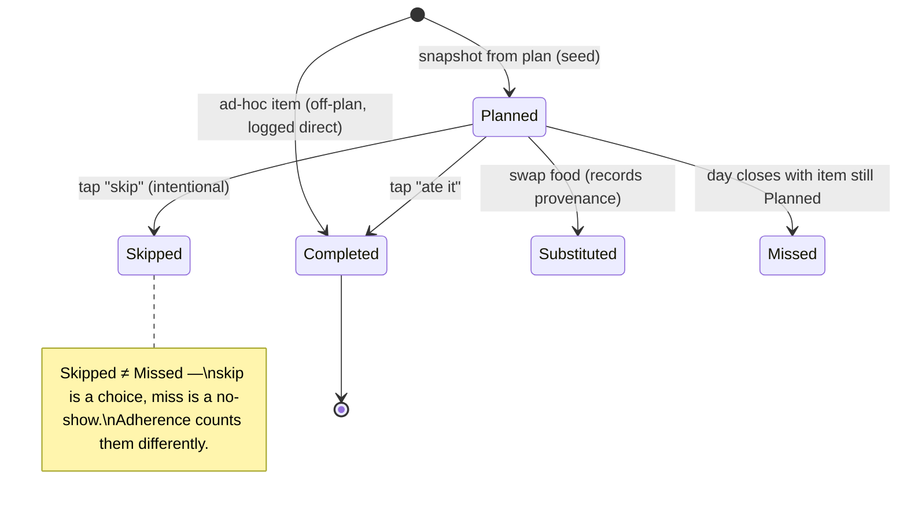
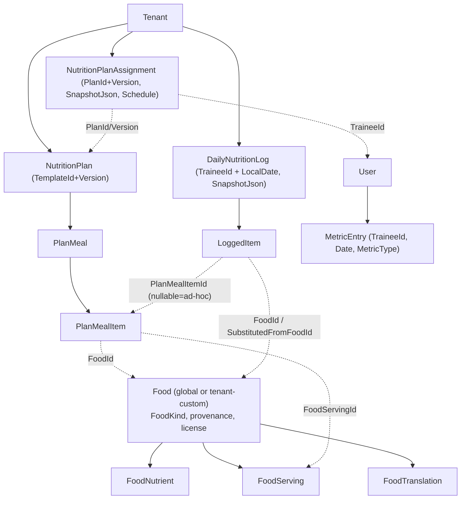

# Nutrition — Business & Domain Model

The business model, the aggregates and their invariants, entity relationships, supplements, the nutrient model,
and the extensibility spine that turns today's check-offs into tomorrow's analytics.

**Related:** [ARCHITECTURE.md](ARCHITECTURE.md) (the decisions) · [DATABASE.md](DATABASE.md) (physical schema) ·
mirrors the aggregate conventions in [BUSINESS_RULES.md](../BUSINESS_RULES.md).

## 1. Business model

GymBro's existing business is **coach ⇄ client inside a gym (tenant)**: an Owner prescribes structured work, a
Client performs and logs it, and both see progress. Nutrition extends the *same relationship* to eating:

- **Coach (Owner)** authors **nutrition plans** (a day's worth of prescribed meals + supplements, with times and
  training/rest-day variants) and **assigns** them to clients — the identical author→assign motion as workout
  plans. A self-training Owner can "follow this myself."
- **Client (Trainee)** sees **today's plan as a checklist**, logs each item with one tap (ate it / skipped it /
  swapped it), logs **off-plan** food just as fast, and gets **reminders** so adherence is high.
- The system measures **planned-vs-actual** every day, rolls it into **adherence + streaks + consistency**, and
  surfaces it to both sides — the nutrition analogue of session volume / PR count.

The MVP's product wedge is **adherence, not calorie-counting**. MyFitnessPal-style gram-by-gram logging is slow
and abandoned within weeks; "did you follow your coach's plan today?" is a 10-second daily interaction that a
coached client will actually sustain. Calories/macros are computed silently from the catalog so the richer
analytics exist *when* the user (or coach, or AI) wants them — without ever having demanded data entry.

### Actors & their nutrition capabilities

| Actor | Nutrition capability | Permission gate (new) |
|---|---|---|
| Owner (coach) | author/version/assign nutrition plans; view any client's adherence in their gym | `NutritionPlanCreate/Update/Delete/Assign`, `NutritionLogViewAll` |
| Client (trainee) | log own days, swap/skip/add items, log one-offs and metrics | `NutritionLogCreate`, `NutritionLogViewOwn` |
| Self-training Owner | "follow this myself" (self-assign at Full visibility) | same as both, in own gym |
| Platform Admin | curate the global Food/Supplement catalog | `IPlatformAdminRequest` (reuses existing) |

## 2. The two contexts and their aggregates

```
Modules.Food (catalog — sibling of Exercise)
  Food (aggregate root)                     -- a food OR supplement OR beverage (FoodKind discriminator)
   ├─ FoodNutrient        (per-100g/per-serving nutrient amounts — flexible, lookup-keyed)
   ├─ FoodServing         (named portions: "1 scoop" = 30 g, "1 medium banana" = 118 g)
   ├─ FoodTranslation     (localized name/aliases — mirrors ExerciseTranslation)
   └─ (provenance/license fields on the root)

Modules.Nutrition (plan + routine + log — sibling of WorkoutPlan + WorkoutSession)
  NutritionPlan (aggregate root, versioned TemplateId+Version)
   └─ PlanMeal            (a meal slot: name, ScheduledTime, DayApplicability, order)
        ├─ PlanMealItem   (FoodId + serving + quantity + target macros snapshot)
        └─ (PlanSupplement modeled as a PlanMealItem whose Food is a supplement, or a standalone supplement slot)

  NutritionPlanAssignment (aggregate root)   -- pins PlanId+Version, SnapshotJson, visibility, Schedule, dates

  DailyNutritionLog (aggregate root, one per (trainee, local date))
   └─ LoggedItem         (the unit of logging: planned-or-adhoc, status, denormalized food + nutrition snapshot)

  MetricEntry (aggregate root)               -- the extensibility spine: weight/water/sleep/mood/photo/…
```

### 2.1 `Food` (catalog aggregate) — the Exercise sibling

Mirrors `Exercise`: an `ISharedEntity` (global when `OwnerTenantId == null`, tenant-custom otherwise) +
`ISoftDelete` `AggregateRoot`, admin-write for the global catalog, readable by any member. A `FoodKind`
discriminator (`Food | Supplement | Beverage`) lets one pipeline serve meals and supplements without a parallel
hierarchy — supplement-specific fields (`Form`: capsule/powder/liquid; default dose) are nullable columns that
only supplements populate.

**Invariants (factory-enforced, throw `DomainException`):** name required; at least an energy value or an
explicit "no nutrition data" flag; serving sizes positive; `OwnerTenantId == null ⇒ created by platform admin`;
nutrient amounts non-negative; provenance (`Source` + `LicenseCode`) set. These mirror the exercise catalog's
"≥1 muscle with ≥1 primary, calories ≥ 0, name required" gate.

### 2.2 `NutritionPlan` (template aggregate) — the WorkoutPlan sibling

**Draft-first** `TemplateId` chain: a single mutable **draft head** absorbs every edit (the draft is replaced at
the same `Version`, deep-copying `PlanMeal → PlanMealItem` into a fresh row — never mutated in place), and **only
`PUT /plans/{id}/publish` advances the published version** that trainees and assignments see. A new plan is a draft
(`IsDraft = true`) and must be published before it can be assigned; soft-delete is blocked while a live assignment
pins a version. **This is the workout-plan lifecycle verbatim** ([BUSINESS_RULES.md](../BUSINESS_RULES.md) "Workout
plan lifecycle") — we reuse its draft/publish rules, the published-only unique index, and the `409`-on-stale-id
semantics.

A `PlanMeal` adds the recurrence fields (`ScheduledTime`, `DayApplicability`) that workouts lacked; a
`PlanMealItem` carries `FoodId`, a chosen `FoodServingId` + `Quantity`, and a **target-nutrition snapshot**
(target kcal/protein/carbs/fat for that item, captured from the food at authoring time so a later catalog edit
doesn't silently move the coach's targets).

### 2.3 `NutritionPlanAssignment` — the PlanAssignment sibling

Pins `PlanId + PlanVersion`, stores a `SnapshotJson` of the whole plan at assign time, carries the same
visibility model (below), `StartDate`/`EndDate`, `IsActive` (pause/resume), and the new structured `Schedule`
(recurrence defaults + per-meal overrides). One live assignment per (trainee, plan) — the workout uniqueness rule
reused. `apply-latest` (`PUT /assignments/{id}/apply-latest` — re-points to the latest **published** version and
rebuilds the pinned snapshot server-side), the "New vX" version-sync indicator, pause/resume, and the "trainee may
hold multiple active assignments, picks at log time" behaviour all carry over.

### 2.4 `DailyNutritionLog` (+ `LoggedItem`) — the WorkoutSession sibling

One aggregate per **(trainee, local calendar date)**. Created lazily on first touch of that date (Decision 2),
snapshotting the applicable planned meals into `SnapshotJson` and seeding one `LoggedItem` per planned item with
`Status = Planned`. Thereafter every interaction is a state transition on a `LoggedItem`, or the addition of an
**ad-hoc** `LoggedItem` (off-plan eating). At local midnight (or first interaction the next day) the prior day is
**closed**: any still-`Planned` items become `Missed`, `AdherencePct` is finalized, and `DailyLogClosedEvent` is
raised through the outbox.

**`Source` and the self-logged day (as built).** The root carries a `NutritionSource`: a day seeded from an
active assignment is `FromAssignment` (opened via `DailyNutritionLog.Open(..., NutritionPlanAssignmentId,
SnapshotJson)`). When a trainee logs off-plan food on a date **no assignment governs**, the
`NutritionDayProvisioner` instead opens a plan-less **self-logged** day via
`DailyNutritionLog.OpenSelfLogged(traineeId, tenantId, date, tz)` with `Source = NutritionSource.Adhoc` (the
previously-unused enum value, now in use): no assignment, no snapshot, `AdherencePct = 0`. The day is still
stamped with a gym — the **active gym** from `ITenantContext.TenantId` (the trainee write surface
`/api/nutrition/log/*` is tenant-scoped, so the header tenant is present). A nutrition day is unique per
`(trainee, date)` globally, so its `TenantId` is simply the gym active when the day was first created;
`TenantId` stays non-null and the EF tenant filter keeps the day invisible to coaches in other gyms. Only
**writes** create this row; a READ with no assignment and no existing day returns a non-persisted empty day instead.



**Invariants:** mutations only while the day is **open** (today or a still-open recent date — mirrors "mutations
only while `InProgress`"); status transitions are guarded; an ad-hoc item carries no `PlanMealItemId`; substitute
preserves `SubstitutedFromFoodId` (the `SubstitutedFromExerciseId` pattern). Children (`LoggedItem`) hard-delete;
the root soft-deletes — identical to `WorkoutSession`/`PerformedExercise`.

### Decision — `Skipped` and `Missed` are distinct first-class statuses

The brief explicitly calls out **"missed vs skipped items."** We model them as different terminal states:
**`Skipped`** is an intentional user action ("I'm not having the pre-workout shake today"); **`Missed`** is the
system marking a still-`Planned` item when the day closes (a no-show). *Why it matters:* a coach reading adherence
needs to distinguish "client deliberately deviated" from "client forgot/ghosted" — they prompt different
interventions. *Alignment:* this generalizes the workout module's `Skipped` status (which only had the
intentional sense) by adding the time-driven `Missed`, computed at day-close exactly as `PrCount` is computed at
session-complete.

## 3. Entity relationships



The shape is **deliberately isomorphic** to the workout ER diagram in [DATABASE.md](../DATABASE.md): a global
catalog referenced by FK from a versioned tenant template and from a per-day tenant log, with snapshots pinning
history. A reviewer who understands the workout data model already understands this one.

## 4. Visibility & coaching control (reused)

The assignment carries the same viewer-aware, filter-on-read controls as workouts
(`PlanVisibilityMode { Full, Guided, Blind }` + hide-flags), adapted to nutrition:

- **Full** — trainee sees the whole plan and every target.
- **Guided** — `HideMacroTargets` (show the meals, hide the gram/calorie targets — common for clients a coach
  wants focused on *behaviour*, not numbers), `HideFutureDays` (only today's plan), `DisableTraineeEditing`
  (blocks structural swaps/adds but **never** blocks logging actuals — recording what you ate is always allowed,
  mirroring the workout rule).
- **Blind** — no plan snapshot; the trainee logs free-form (used for "just track me, no prescription" clients).

*Why reuse rather than invent:* the hide-on-read, snapshot-never-redacted, coach-always-sees-full machinery is
already built, server-enforced, and documented; nutrition needs the same coaching dial and gets it for free.

## 5. The nutrient model — additive axes, not a fixed column set

A `Food` does **not** get `Calories/Protein/Carbs/Fat` as four hard columns. Instead, `FoodNutrient(FoodId,
NutrientId, AmountPer100g)` references a closed **`Nutrient` lookup** (energy, protein, carbohydrate, fat, fiber,
sugar, sodium, … and any micronutrient added later). This is the **exact "closed sets are lookup tables
referenced by ID / additive over destructive" principle** from the
[master-data architecture](../master-data/MASTER_DATA_ARCHITECTURE.md) — adding vitamin D or omega-3 later is a
new lookup row, not a migration.

- A small set of **headline nutrients** (energy, protein, carbs, fat) are also **denormalized onto the `Food`
  root** as nullable columns for the hot path (list rendering, quick macro math) — the same pragmatic
  denormalization the exercise catalog uses for its hot fields. The normalized `FoodNutrient` rows remain the
  source of truth for the long tail.
- Amounts are stored **per 100 g (canonical)**; servings convert. Units are canonical (grams, kcal) and formatted
  on display, matching the "store kg, format on display" rule.

## 6. Denormalization — the durable-history move (Decision 5, detailed)

When a `LoggedItem` is created (planned seed, ad-hoc add, or substitution), it **captures a nutrition snapshot at
log time**:

```
LoggedItem {
  Id, DailyNutritionLogId, PlanMealItemId?,        -- null ⇒ ad-hoc / off-plan
  FoodId, SubstitutedFromFoodId?,
  FoodNameSnapshot,                                 -- like PerformedExercise.ExerciseName
  ServingLabelSnapshot, Quantity,
  EnergyKcalSnapshot, ProteinGSnapshot,            -- like PerformedExercise.TrackingType:
  CarbsGSnapshot, FatGSnapshot,                     --   the metrics needed are captured, not re-resolved
  Status, LoggedAtUtc, ClientLocalTime, Note, PhotoRef?
}
```

- **Why:** a coach renames "Whey (vanilla)" → "Whey Protein", or a global food is retired, *after* the client
  logged it. Without the snapshot, history rewrites and yesterday's adherence/macros change underneath everyone.
  This is precisely the bug the workout module's denormalized `ExerciseName` + `TrackingType` prevents.
- **How it aligns:** identical to [BUSINESS_RULES.md](../BUSINESS_RULES.md) "Durable session history" — capture at
  log time, prefer the stored value on read, never re-resolve per row.
- **Alternatives:** join to the live `Food` on every read (rejected — non-durable, and a deleted food breaks the
  read); store only `FoodId` and accept history drift (rejected — corrupts the analytics the feature exists for).
- **Why preferred:** the only approach that makes logs **immutable historical facts**, which is the foundation of
  every downstream analytic.

This is also what makes **completion-first logging** work: the user taps "ate it"; the macros were captured
silently at seed/log time, so macro analytics are fully available later with zero extra taps.

## 7. Catalog sourcing & provenance (catalog only)

Foods, like exercises, are master data with licensing concerns — and they are handled with the **same discipline**
the [master-data DATA_SOURCE_COMPARISON](../master-data/DATA_SOURCE_COMPARISON.md) established:

- **Seed legally-clean.** Recommended base: **USDA FoodData Central** (a U.S. Government work → public domain) for
  the core whole-foods catalog and its nutrient data. Provenance (`Source`, `LicenseCode`, `ExternalId`) travels
  on every row.
- **Quarantine share-alike.** **Open Food Facts** is rich for branded/packaged products but is **ODbL** — a
  share-alike/copyleft regime, the food analogue of the exercise catalog's CC-BY-SA quarantine. It must be a
  **separate, attributed** source (or kept out of the owned master table entirely), never silently blended.
- **Custom foods are tenant-scoped.** A coach's "my protein blend" is a `Food` with `IsCustom = true`,
  `OwnerTenantId = <gym>` — the `ISharedEntity` tenant-override the exercise catalog already supports.
- **Cite, don't copy.** Atwater factors (4/4/9 kcal per g for protein/carb/fat), BMR formulae (Mifflin-St Jeor,
  Katch-McArdle), and nutrient reference values are facts usable with citation; specific dataset *content* obeys
  its dataset license.

> **Integrity caveat (carried from the master-data mandate):** the exact licensing of USDA FDC and Open Food
> Facts, and any shipped nutrient/formula constant, **must be re-verified against source before implementation.**
> This proposal models the *approach*; it imports no data.

## 8. The extensibility spine — `MetricEntry` (Decision 6, detailed)

> **Status: MVP slice built.** `MetricEntry` now exists as an entity + table (migration
> `Nutrition_MetricEntry`) with the GET/POST `/api/me/nutrition/metrics` endpoints the Flutter check-in UI
> calls — check-in data IS persisted server-side. The built slice is deliberately simpler than the full
> design below: `Type` is a free-form string (no `MetricType` lookup table yet), the value is a single
> numeric (`value` + optional `unit`), the row carries **no TenantId** (purely personal, self-scoped — see
> [DATABASE.md](DATABASE.md)), and the series is append-only newest-first ("latest" = first entry per type).
> **Still deferred:** the `MetricType` lookup/`ValueKind` typing, photos (`PhotoRef`), wearable/AI sources,
> and per-type uniqueness rules.

The brief's "think beyond logging" list — body weight, body fat, measurements, water, fiber, micronutrients,
recovery, sleep, energy, digestion, mood, custom notes, photos, wearables, AI — is **long, heterogeneous, and
open-ended.** Modelling each as its own table guarantees a migration per signal forever. Instead, one additive
series:

```
MetricType (lookup, closed set, app-i18n labels):
  BodyWeight, BodyFatPct, WaterMl, SleepHours, EnergyLevel, Mood, Digestion, RestingHR,
  Steps, Waist, Hip, … + Custom        -- ValueKind: numeric | scale-1-5 | duration | text | photo

MetricEntry (aggregate root):
  Id, TraineeId, TenantId?, MetricTypeId, LocalDate, RecordedAtUtc,
  NumericValue?, TextValue?, ScaleValue?, Unit?, Note?, PhotoRef?, Source   -- Source: manual | wearable | ai
```

- **Why one series:** a new signal (HRV from a wearable, a coach-defined "hunger 1–5") is a **new `MetricType`
  row + writes**, never a schema change. Wearable ingestion and AI-derived metrics in later phases just write
  `MetricEntry`s with `Source = wearable|ai`. This is the master-data doc's "additive over destructive" applied to
  the user's *own* longitudinal signals.
- **How it aligns:** structurally it is "a typed value series keyed by a lookup," the same shape as
  `FoodNutrient`/`ExerciseMuscle`. It is `/api/me`-scoped (personal, cross-gym) like sessions.
- **Alternatives:** a wide "daily check-in" table with a column per signal (rejected — every new signal is a
  migration and most columns are null most days); EAV with stringly-typed everything (rejected — loses query
  power and typing). The typed-`ValueKind` series is the middle path: flexible *and* queryable.
- **Why preferred:** it future-proofs the entire "future expansion" list behind one stable contract, which is the
  explicit ask — "robust enough to support these capabilities later" without major redesign.

Body weight deserves a note: it is *both* a `MetricEntry` (the user's longitudinal series) *and* an existing
field — `WorkoutSession.BodyweightKg` already captures it at workout time. The nutrition `MetricEntry` becomes the
**canonical weight series**, and a future enhancement can backfill/cross-reference session bodyweight into it — no
conflict, just a richer single timeline.

## 9. Domain events (outbox, reused)

| Event | Raised when | Consumer (MVP) | Future consumers |
|---|---|---|---|
| `DailyLogClosedEvent(traineeId, tenantId, date, adherencePct, missedCount)` | a day closes | log-only (mirrors `SessionCompletedEvent` today) | streak recompute, coach digest, AI insight, push "you missed X" |
| `NutritionPlanAssignedEvent(assignmentId, traineeId)` | a plan is assigned | seed today's log eagerly; schedule reminders | onboarding nudge |

Both go through the existing **transactional outbox** (written in the same `SaveChanges`, dispatched by
`OutboxProcessor`, at-least-once, idempotent handlers) — no new eventing infrastructure. This keeps the door open
for the analytics/coaching/AI consumers without committing to them in MVP.
