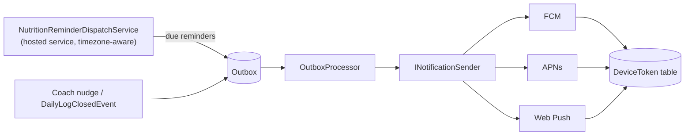
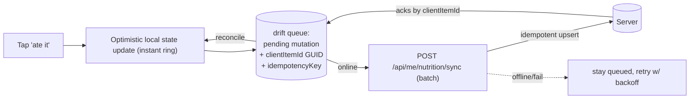

# Nutrition — Reminders, Notifications & Offline Sync

> **Status: everything in this document is deferred — none of it is implemented** (no reminders, no push, no
> `DeviceToken`, no offline queue or `/sync` endpoint).

The three capabilities GymBro has never had. Each is **net-new**, so each gets a careful design with phasing that
keeps the MVP shippable before the hard parts land. **Grounding fact from discovery:** there is *no* local-DB,
local-notification, push, service-worker, or background-task code in **any** repo today — the API's only async/
background machinery is the **transactional outbox + hosted services** (OutboxProcessor, cleanup, reconciliation)
and **SMTP email**. We build on those, and add the rest minimally.

**Related:** [ARCHITECTURE.md](ARCHITECTURE.md) (decisions 3–4) · [API_AND_PERMISSIONS.md](API_AND_PERMISSIONS.md)
(idempotent writes) · [DOMAIN_MODEL.md](DOMAIN_MODEL.md) (the `Schedule`).

## 1. Recurrence & reminders — client-local-first (MVP)

### The recurrence rule set (shared, three runtimes)

Recurrence is declarative data on the assignment (`ScheduleJson` + per-`PlanMeal` `ScheduledTime` /
`DayApplicability`), evaluated by **one rule set authored once and mirrored**:

- `BuildingBlocks.Shared.Nutrition.NutritionScheduleRules` (C#) — server source of truth; used by the snapshot
  step when a `DailyNutritionLog` opens.
- `lib/domain/nutrition_schedule.dart` (Flutter) and an Angular `nutrition-schedule.ts` — **mirrors**, exactly as
  `ExerciseTrackingRules` is mirrored by both clients today.

Input: `(date, isTrainingDay, assignmentSchedule)`. Output: ordered `[{mealName, localTime, items}]`. The
"is today a training day?" bit comes from the workout context via the `IsTrainingDayQuery` cross-module read
(server) or is passed from the client's already-loaded workout state.

### Reminders = scheduled local OS notifications

Because the day's meal times are **deterministic and known on-device**, the MVP reminder is a **local
notification** — no server involved:

- Flutter: add `flutter_local_notifications`. On app open / plan change / midnight rollover, compute today's (and
  tomorrow's) meal times from the shared rule set and (re)register local notifications ("Pre-workout shake in 15
  min", "Lunch — tap to log"). Tapping deep-links to the Today checklist with the item focused.
- Quiet hours + per-meal toggles are **user prefs** stored locally (and optionally synced as `MetricType`-style
  settings later). Respect OS notification permissions; degrade gracefully if denied.

**Why local-first for MVP:**
- **Why:** zero new server infrastructure, works fully offline, privacy-preserving (no meal schedule leaves the
  device), and reliable on mobile (the OS fires it even if the app is closed). It directly serves the brief's
  "reminder and notification workflows" + "missed item detection" (a local notification can also fire a
  "you haven't logged lunch" nudge from on-device state).
- **How it aligns:** matches the platform's minimal-dependency ethos (the Flutter app ships **7** deps on
  purpose) and the "client lightly derives, server is the boundary" principle — reminders are a *derivation* of
  data the client already has.
- **Alternatives:** server push from day one (rejected for MVP — see §2's cost); web Notification API for the
  portal (weak: requires the tab open or a service worker; the portal is a coach/review surface, not the daily
  logger, so reminders there are low-value for MVP).
- **Why preferred:** highest reliability-per-effort for the daily-logging use case, and it ships without touching
  the backend.

### Web reminders

Deferred. The portal is the coach/authoring/review surface; trainees who want reminders use the mobile app. If
web reminders are later wanted, a **PWA + service worker + Web Push** is the path (the portal has `@angular/
service-worker` available but unconfigured) — folded into the §2 server-push phase.

## 2. Server-driven push & dispatch — designed, deferred

Needed for capabilities local notifications **cannot** do: **coach-initiated nudges** ("your coach added a
note"), **cross-device** consistency, **adherence alerts** ("3 meals missed today"), and **web** reminders. This
is real new infrastructure, so it is a **later phase**, fully specified here so MVP choices don't paint us into a
corner.

- **`DeviceToken`** table (no tenant marker — a device belongs to a *user* across gyms; scoped by `UserId` like
  `UserTenantRole`), registered by the client, revoked on logout-all (reuse the revocation instincts).
- **`INotificationSender`** abstraction with FCM/APNs/Web-Push adapters — credentials via the existing config/
  secret mechanism (`Notification:*`), absent ⇒ no-op (mirrors how SMTP degrades to a logger when unconfigured).
- **`NutritionReminderDispatchService`** — a hosted `BackgroundService` alongside `OutboxProcessor`/cleanup. It
  wakes periodically, finds users whose **local** time has reached a scheduled reminder (timezone is the hard
  part — store the trainee's tz on the assignment/day and the device, compute "due" in their local time), and
  **writes a reminder to the outbox** rather than sending inline — so delivery inherits the outbox's
  at-least-once, multi-instance-safe (`FOR UPDATE SKIP LOCKED`) guarantees.
- **Adherence/coach alerts** ride `DailyLogClosedEvent` (already raised) → an outbox handler composes the push.

**Why deferred, not MVP:** it is the single largest new subsystem (device tokens, three push transports, tz-aware
scheduling, quiet-hours, dedupe-with-local-notifications). None of it is needed to validate the core loop, and
local notifications cover the daily-reminder 80%. Shipping it in MVP would multiply risk and timeline for a
capability the first cohort doesn't need.

**Why this placement aligns:** it reuses the outbox + hosted-service pattern the platform already operates and
trusts, so "reliable scheduled delivery" is a *configuration of existing machinery*, not a new reliability story.

## 3. Offline-first logging (Flutter, MVP) — the local mutation queue

Nutrition logging must tolerate no-signal moments (Decision 4). The design is the **smallest correct primitive**,
not a sync framework.

### Mechanism

- A local **`drift` (SQLite)** store holds: the **mirror of recent days** (so "Today" and the last N days render
  offline) and a **pending-mutation queue** (each row = one `LoggedItem` create/edit/skip/substitute/metric with
  a **client-generated GUID `clientItemId`** + **idempotency key** + a monotonic local seq).
- Writes are **optimistic**: local state + queue update first (instant UI), network later.
- On connectivity, the queue flushes via **`POST /api/me/nutrition/sync`** (batch) — the server **upserts
  idempotently** by `clientItemId` (a replay is a no-op success), returns server truth per item, and the client
  reconciles + clears the queue.
- **Conflict policy: last-write-wins per item**, which is sufficient because nutrition writes are **single-author
  and append-mostly** (a user edits *their own* day; there is no concurrent second editor). A coach never writes
  a trainee's log. This is why a CRDT/merge engine is unnecessary.

### Scope discipline (MVP vs later)

- **MVP:** offline **writes** (the critical path — never lose a logged meal) + offline **read** of cached recent
  days. One-directional flush with idempotent upsert.
- **Later:** richer two-way reconciliation if a real multi-device-edit case emerges (e.g. logging on phone +
  tablet same day) — the `clientItemId` + server-truth-on-ack design already supports adding it without rework.
- **Web portal: online-first, no queue.** The coach/review surface doesn't need it; adding `drift`-equivalents to
  Angular is unjustified cost. (PWA offline is a far-future option bundled with web push.)

### Why this is safe and aligned

- **The API stays stateless and "offline-unaware"** — it just accepts client ids and upserts. No server change
  beyond the idempotent write contract ([API_AND_PERMISSIONS §4](API_AND_PERMISSIONS.md)).
- **Idempotency is already the platform's posture** (at-least-once outbox; duplicate-insert tolerance in the
  session start-handler) — we extend it to the write path rather than inventing a sync protocol.
- **Tenant isolation is untouched** — queued writes still carry the user's auth on flush and hit the self-scoped
  `/api/me` surface; nothing bypasses validation or scoping.
- **Failure modes are benign:** app killed with a full queue ⇒ persisted in SQLite, flushes next launch; duplicate
  flush ⇒ idempotent no-op; permanent server rejection of one item ⇒ that item rolls back in the UI with a toast,
  the rest proceed.

### Dependency cost

Flutter adds `drift` (+ `sqlite3_flutter_libs`) and `flutter_local_notifications` — a deliberate, bounded
increase from today's 7 deps, each justified by a brief requirement (offline logging; reminders). No FCM/APNs/
push deps until the §2 phase. This is the *only* place the proposal grows the mobile dependency surface, and it
is called out explicitly so the trade-off is a conscious one.

## 4. Timezone & day-boundary correctness (the subtle risk)

"Which day did I eat that?" must be stable. Rules:

- A `DailyNutritionLog.LocalDate` is computed from the trainee's timezone **at open time**, and the tz is
  **stored on the row** (`ClientTimezone`, like `WorkoutSession.ClientTimezone`). Travel across timezones doesn't
  retro-relabel past days.
- Day-close (Planned ⇒ Missed, adherence finalize) fires at the trainee's **local** midnight — handled
  **lazily** on first interaction the next local day (no global midnight job), mirroring the lazy-open design.
  The optional server dispatch service (§2) can also close stale days for adherence alerts.
- Reminders fire in **local** time; the shared schedule rule operates on `TimeOnly` + the device/stored tz.

This is the highest-attention correctness area in the feature and is deliberately isolated to the schedule/day
subsystem so it can be tested exhaustively (pure-function `NutritionScheduleRules` + day-boundary unit tests) in
the established no-device test style.
