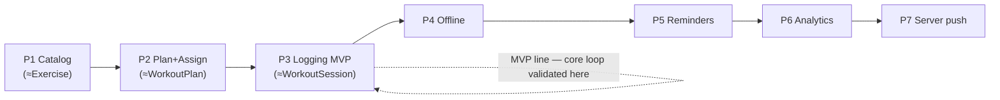

# Nutrition — Risks, Trade-offs, Extensibility & Phased Roadmap

The honest risk ledger, the deliberate trade-offs, how the design extends without redesign, and a phased plan
that ships the proven reuse spine before the genuinely-new subsystems.

**Related:** [ARCHITECTURE.md](ARCHITECTURE.md) · [REMINDERS_AND_OFFLINE.md](REMINDERS_AND_OFFLINE.md) (where the
risk concentrates).

## 1. Risks & trade-offs

| # | Risk / trade-off | Likelihood × impact | Mitigation | Owner area |
|---|---|---|---|---|
| R1 | **Timezone / day-boundary correctness** — "which day did I eat that?" mis-attribution; day-close firing wrong | Med × High | Store tz on the row (like `WorkoutSession.ClientTimezone`); pin `LocalDate` at open; lazy local-midnight close; pure-function `NutritionScheduleRules` exhaustively unit-tested | Schedule subsystem |
| R2 | **Offline sync correctness** — duplicate or lost logs on flaky networks | Med × High | Client GUID `clientItemId` + idempotent server upsert; persisted `drift` queue; single-author last-write-wins (no concurrent editors) | Offline queue |
| R3 | **Notification reliability / spam** — reminders not firing, or annoying users into disabling them | Med × Med | Local-first (OS-reliable) for MVP; quiet hours + per-meal toggles; defer server push until needed | Reminders |
| R4 | **Recurrence model too rigid or too complex** — real meal plans don't fit the schema | Med × Med | Day-type + per-meal time + weekday mask covers observed cases; declarative + versioned so it evolves; *not* RRULE (over-flexible) nor generated rows (rigid) | Domain model |
| R5 | **Food catalog licensing contamination** — share-alike data leaks into the owned table | Low × High | Reuse the master-data quarantine discipline: USDA FDC (public domain) seed; Open Food Facts (ODbL) separate/attributed; provenance+license per row; import refuses quarantined licenses | Catalog |
| R6 | **Catalog data quality / coverage** — users can't find foods, branded items missing | Med × Med | Tenant-custom foods (coach adds "my blend"); FTS+trigram search (master-data blueprint) when catalog grows; start with a curated common-foods seed | Catalog |
| R7 | **Mobile dependency growth** — `drift` + `flutter_local_notifications` enlarge the 7-dep surface | Low × Low | Bounded, each justified by a brief requirement; no FCM/push deps until the later phase; explicitly flagged | Flutter |
| R8 | **Scope creep into calorie-counting** — pressure to build full macro entry in MVP | Med × Med | Hold the line on completion-first; macros captured silently, exposed read-only later — keeps the daily loop fast | Product |
| R9 | **Cross-module coupling (training-day query)** — nutrition depends on workout state | Low × Med | One read-only MediatR contract (`IsTrainingDayQuery`), the sanctioned cross-module mechanism; graceful default (treat as rest day) if absent | Module boundary |
| R10 | **Sensitive health data exposure** | Low × High | Private-by-default signed-URL photos; visibility-gated coach reads bounded to gym membership; covered by existing user-delete cascade | Security |

**The shape of the risk:** ~80% of the feature is structural reuse (modules, persistence, CQRS, tenancy, the
plan/log spine, both clients' state patterns) and is **low-risk by construction** — it clones tested code paths.
The risk is concentrated in the **20% that is new** (R1–R3, R7), and that 20% is **isolated into its own
subsystems and phaseable**, so the MVP can prove the core loop before any of it is hardened.

### Key trade-offs made (and why)

- **Completion-first, not calorie-first** — trades "comprehensive macro precision on day one" for "a daily habit
  users actually sustain + silently-rich data." The brief explicitly wants fast logging *and* rich data; this is
  the only way to get both.
- **Offline on mobile, online on web** — trades uniformity for fit-to-use; the web is a coach/review surface that
  doesn't need a sync engine.
- **Local reminders before server push** — trades coach-nudge/cross-device (later) for shipping reminders with
  zero backend risk now.
- **Two modules, not one or three** — trades a tiny bit of "everything-nutrition-in-one-place" for boundary
  compliance and the right coupling granularity.

## 2. Future extensibility — designed-in, not bolted-on

Every item on the brief's "future expansion" list is already absorbed by an existing seam:

| Future capability | How it lands with **no redesign** |
|---|---|
| Calories, macros, protein | denormalized macro snapshots already captured per `LoggedItem`; expose read-only views |
| Fiber, sugar, sodium, micronutrients | new `Nutrient` lookup rows + `FoodNutrient` rows — additive, no schema change |
| Water intake | a `MetricType` (`WaterMl`, `AllowMultiplePerDay`) — already supported |
| Body weight, body fat, measurements | `MetricEntry` series; weight cross-references existing `WorkoutSession.BodyweightKg` |
| Recovery, sleep, energy, digestion, mood | `MetricType` rows (`ValueKind` = numeric/scale/text) — additive |
| Custom notes | `LoggedItem.Note` + `MetricType = Custom` + day notes |
| Photos (meal / progress) | `PhotoRef` (object storage + signed URLs, master-data MEDIA_STRATEGY) |
| Wearable integration | write `MetricEntry`s with `Source = wearable`; an ingestion adapter is a new writer, not a new model |
| AI recommendations | the adherence + metric + training-day series is prompt-grounding input; nullable AI fields per the master-data additive pattern |
| Recipes / multi-ingredient meals | a `Food` with `FoodKind = Recipe` composed of child `FoodNutrient`-equivalents, or a future `Recipe` aggregate referencing `Food`s — the catalog model extends |
| Barcode scanning | a client capability that resolves to a `Food` via `ExternalId` (Open Food Facts barcode) — read-path only |
| Macro targets / calorie goals per client | a `MetricType`-style target or a field on the assignment — additive |

The unifying principle, inherited from the master-data architecture: **closed sets are lookups, open prose/signals
are typed series, identity is stable, additive over destructive.** New capability = new rows, not new schema.

## 3. Phased implementation roadmap

Each phase is independently shippable and ordered so **proven reuse lands first, new subsystems last**. A phase's
"gate" is what must be true to start the next.

### Phase 0 — Proposal sign-off *(this document set)*
- Review + approve the architecture, domain model, and scope. **No code.**
- **Gate:** stakeholder agreement on completion-first MVP and the two-module split.

### Phase 1 — Catalog foundation (`Modules.Food`)
- `Food` aggregate (+ nutrients/servings/translations), EF config, migration, admin CRUD, member read, distributed
  cache — cloned from `Modules.Exercise`.
- File-based USDA-FDC public-domain seed (`--seed-foods`), license-tagged, following the exercise-seeding flow.
- Tenant-custom foods. Basic name/alias search.
- **Gate:** a coach can find/add foods; catalog reads are cached and tenant-correct.

### Phase 2 — Plan + assignment (`Modules.Nutrition`, authoring)
- `NutritionPlan` (versioned), `PlanMeal`/`PlanMealItem`, structure edit (one-save-one-version), delete guards —
  cloned from `WorkoutPlan`.
- `NutritionPlanAssignment` (pin version, snapshot, visibility, schedule), `apply-latest`, pause/resume.
- Angular plan builder + assignment screens (clones of the workout equivalents). New: schedule editor control.
- **Gate:** a coach can author, version, and assign a nutrition plan with a daily schedule + visibility.

### Phase 3 — Daily logging MVP (the core loop)
- `DailyNutritionLog` (snapshot-on-touch) + `LoggedItem` (status, denormalized snapshots, ad-hoc, substitution).
- Idempotent `/api/me/nutrition/*` write surface; coach `/api/nutrition/logs` read.
- `DailyLogClosedEvent` → outbox; stored `AdherencePct`/streak read-model.
- Flutter **Today checklist** (the primary tab) with optimistic updates; Angular trainee/coach views.
- `MetricEntry` spine + weight/water logging (cheap, unlocks Phase 6 analytics early).
- **Gate:** a trainee can log a full day fast; a coach sees adherence. *This is the MVP.*

### Phase 4 — Offline-first (Flutter)
- `drift` local mirror + persisted mutation queue; `POST /api/me/nutrition/sync` batch flush; idempotent upserts;
  reconciliation; cached-day offline reads.
- **Gate:** logging works through a network outage with no lost/duplicated items.

### Phase 5 — Reminders (client-local)
- `flutter_local_notifications`; shared `NutritionScheduleRules` (C# + both clients); quiet hours + per-meal
  toggles; deep-link to focused item; on-device missed-item nudge.
- **Gate:** reminders fire reliably in local time and respect user prefs.

### Phase 6 — Analytics & coach dashboards
- `/api/me/nutrition/summary` + `/api/nutrition/adherence` read models; training-day vs rest-day comparison;
  weekly/monthly trends; macro dashboards (reading the already-captured snapshots); body-comp trend from
  `MetricEntry`.
- Coach compliance view (missed-vs-skipped patterns, streaks).
- **Gate:** both sides get longitudinal insight with no new instrumentation.

### Phase 7 — Server push & dispatch (deferred infrastructure)
- `DeviceToken` table; `INotificationSender` (FCM/APNs/Web-Push); timezone-aware
  `NutritionReminderDispatchService` hosted service writing to the outbox; coach nudges + adherence alerts; PWA +
  Web Push for the portal.
- **Gate:** cross-device + coach-initiated notifications, reusing outbox delivery guarantees.

### Phase 8+ — Beyond
- Recipes/multi-ingredient, barcode scan, wearable ingestion, AI insights, macro-target goals — each an additive
  extension per §2, no schema redesign.

**The roadmap's logic:** Phases 1–3 are almost entirely *cloning tested code* (the catalog, the plan, the log) and
deliver a usable, data-rich MVP. The new-infrastructure phases (4–5, then 7) follow, each isolated, each optional
to the core loop, each de-riskable on its own. That ordering is the whole point — **ship the reuse, harden the
novelty incrementally.**
